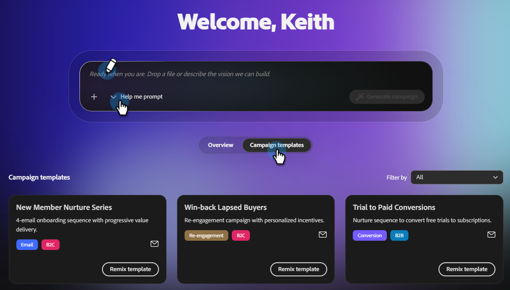
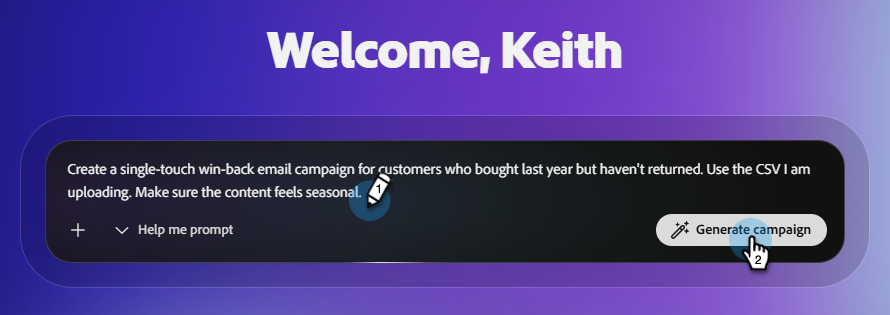
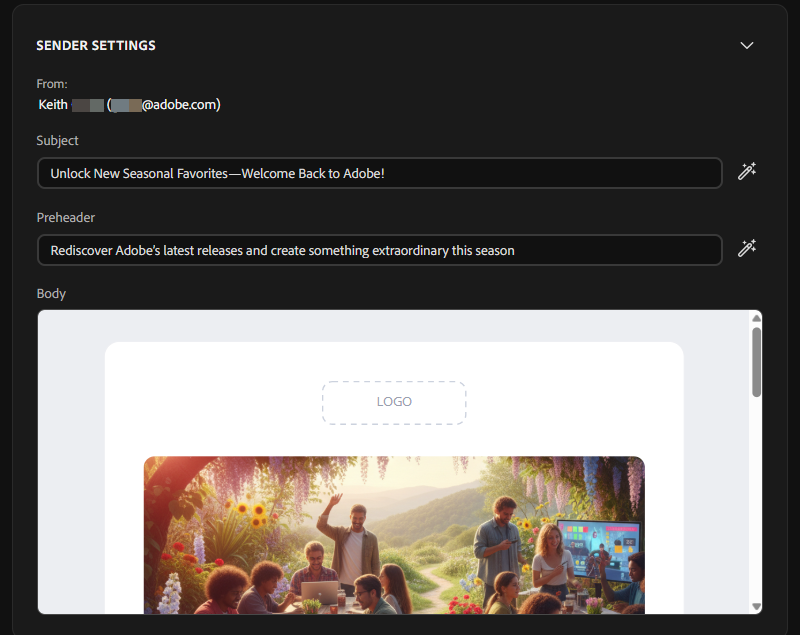

# Criar uma campanha de email {#create-an-email-campaign}

Saiba como criar e revisar campanhas de email completas em minutos.

>[!IMPORTANT]
>
>No momento, só é possível criar campanhas, mas não enviá-las (iniciá-las). A funcionalidade do Launch será lançada em breve.

## Antes de começar

Verifique se você tem:

* Uma conta ativa do CX Enterprise Co-worker ([inscreva-se aqui](https://coworker-essentials.experience.adobe.com/){target="_blank"} se você ainda não tiver uma).

* Sua marca foi configurada em **Seus itens** > **Marcas**.

* (Opcional, mas recomendado) Um modelo de email do HTML carregado em **Seus itens** > **Modelos de email**.

* Um CSV de público-alvo pronto para upload.

* Uma ideia clara do objetivo da campanha (por exemplo, &quot;conquistar clientes antigos&quot; ou &quot;convidar usuários de avaliação para um webinário&quot;).

## Etapa 1: iniciar um novo chat

Na home page, você tem três maneiras de começar:

**Opção 1**: digite um prompt na barra de prompts central.

_Quando usar: Quando você souber exatamente o que deseja._

**Opção dois**: escolha um modelo pronto na seção **Modelos de campanha** abaixo da barra de prompts.

_Quando usar: quando você não tem certeza do que deseja._

**Opção três**: use a opção &quot;Ajude-me a avisar&quot; na lista suspensa na barra de prompts para que o CX Enterprise Coworker o oriente durante a escrita do prompt.

_Quando usar: quando você tiver uma ideia do que deseja, mas quiser alguma ajuda (ou use &quot;Surpreenda-me&quot; para se surpreender)._

{width="800" zoomable="yes"}

## Etapa 2: criar seu prompt

Um forte prompt do CX Enterprise Co-worker inclui:

* A meta da campanha (o que você está tentando alcançar).
* O público-alvo (para quem são ou de onde vêm os dados do público-alvo).
* O formato e a estrutura (número de emails, cadência, tom).
* Sinalizações de marca ou contexto (referências à sua marca, produto ou campanha).

Exemplo:

`"Create a single-touch win-back email campaign for customers who bought last year but haven't returned. Use the CSV I am uploading. Make sure the content feels seasonal."`

>[!TIP]
>
>Para obter mais exemplos, consulte o artigo _Casos de uso_.

>[!NOTE]
>
>Se você já tiver um Resumo da campanha, faça upload dele junto com seu prompt como contexto adicional para o plano criado para você.

Quando o prompt estiver pronto, clique em **Gerar campanha**. O CX Enterprise Co-worker irá então:

* Gerar um plano de campanha estruturado.
* Pergunte pelo seu público-alvo, que também será usado para personalização de conteúdo.
* Conteúdo de email personalizado de rascunho para cada etapa.
* Crie dinamicamente a jornada ao longo do caminho.
* Reúna tudo em um único quadro de campanha.

## Etapa 3: Fazer upload do público

Os públicos-alvo são carregados por CSV. Todos os públicos-alvo são específicos para suas respectivas campanhas.

1. Depois de enviar seu prompt, revise as tarefas que o Co-worker executará e clique em **Compilação**.

1. No painel _Conversão de campanha_, à esquerda, clique em **Carregar CSV**.

   

   >[!NOTE]
   >
   >* Endereço de email é um campo obrigatório, nome e outros campos que podem ser usados para personalização são recomendados.
   >
   >* Campos de personalização que o CX Enterprise Co-worker pode usar: nome, data do último pedido, categoria do produto.

1. Importe seu arquivo CSV.

   >[!TIP]
   >
   >Exclua todos os contatos para os quais você não deseja enviar um email (usuários que cancelaram a inscrição, endereços internos, contas de teste) antes de fazer upload. Embora progressivamente possamos habilitar a funcionalidade para &#39;excluir&#39; usuários específicos ou &#39;adicionar atributos&#39; durante o curso da avaliação, ela não estará disponível imediatamente a partir da data de lançamento.

## Etapa 4: revisar e refinar o Campaign Assets

Para fazer alterações no email, navegue até a direita. Em _Campaign Assets_, clique em **Abrir editor**.

Há duas maneiras de atualizar seu conteúdo.

* Faça manualmente as alterações desejadas selecionando várias seções no email (por exemplo: substitua a linha de assunto, atualize uma imagem etc.).

-ou-

* Use a interface conversacional para fazer alterações conversando diretamente com o CX Enterprise Co-worker. Alguns exemplos incluem:

   * &quot;Torne a linha de assunto mais urgente.&quot;
   * &quot;Encurte a cópia do corpo.&quot;
   * &quot;Torne a call to action mais forte.&quot;
   * &quot;Altere a espera de 3 dias para 5 dias.&quot;

Você também pode usar os botões AI para ajudar a refinar o Assunto ou o Pré-cabeçalho.

## Etapa 5: enviar um email de teste

Antes de iniciar, envie a campanha para você mesmo para analisá-la em uma caixa de entrada real. Use essa opção para garantir que o email esteja renderizando da maneira que você deseja, que os links funcionem, que qualquer personalização seja precisa etc.

>[!NOTE]
>
>No momento, você só pode enviar um email de teste para si mesmo, e apenas um de cada vez.

## Etapa 6: Próximas etapas

A funcionalidade do Launch (envio da campanha de email) será adicionada em breve. Até lá, você pode analisar o conteúdo com sua equipe e iniciar sua próxima campanha.

## Perguntas frequentes

**Por que a primeira resposta demora tanto?**

Isso está gerando uma campanha inteira para você, incluindo a estratégia, o público-alvo necessário, o fluxo de trabalho etc. (escute a gravação da marca 1:15ish)

**O que devo fazer se a saída do CX Enterprise Coworker não estiver correta?**

Use o botão de feedback no canto superior direito e avise-nos para que possamos melhorar a plataforma.

**É possível editar emails diretamente ou somente via chat?**

Você pode fazer ambos.

**Como salvar uma campanha sem iniciá-la?**

Todas as campanhas são salvas automaticamente. Se você precisar de acesso a conversas recentes, elas estarão disponíveis na janela à esquerda (em **Bate-papos** se você não tiver criado sua campanha, em **Campanhas** se você tiver criado).

**Há um limite de tamanho de arquivo para o meu upload de CSV?**

Sim, o limite de tamanho é de 8 MB.

**E se o CSV do meu público-alvo retornar erros?**

Verifique se o arquivo CSV não contém caracteres ocultos &quot;avançados&quot;.

**Como usar modelos de campanha?**

Selecione o modelo desejado e clique em **Remix**. Você pode atualizar todos os tokens de personalização e clicar no ícone **enviar** no canto inferior direito.

**Como faço para compartilhar uma campanha de rascunho com um colega de equipe para revisão?**

Não há nenhum botão &quot;compartilhar&quot; neste momento. No entanto, você pode baixar o conteúdo como HTML ou exportá-lo como um documento do PDF ou do Word.
