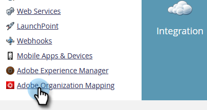

# Configurar mapeamento de organização do Adobe {#set-up-adobe-organization-mapping}

Para sincronizar com aplicativos Adobe, como o Audience Manager, o conector B2B CDP Marketo, o Dynamic Chat, etc., você deve primeiro inserir suas credenciais da Org do Adobe IMS no Marketo.

>[!NOTE]
>
>Uma implantação pronta para HIPAA de uma instância do Marketo não pode usar essa integração.

1. No Marketo, clique em **Administrador**.

   

1. Em Integração, clique em **Mapeamento da organização do Adobe**.

   

1. Clique em **Editar**.

   

1. Insira sua ID da organização do Adobe IMS (saiba como descobrir que [here](https://experienceleague.adobe.com/docs/control-panel/using/faq.html)) e clique em **OK**.

   

1. Clique em **Confirmar**.

   

1. Clique em **Fechar**.

   

   >[!NOTE]
   >
   >Por motivos de segurança, você deve ser um Org Admin da organização do Adobe para a qual deseja mapear. Se não estiver, a ação falhará.

1. Se você estiver _not_ já conectado, uma pop-up será exibida em uma nova guia/janela. Faça logon na organização do Adobe (esta ação valida o acesso da organização).

E é isso! Agora você pode [compartilhar dados do público](/help/marketo/product-docs/core-marketo-concepts/smart-lists-and-static-lists/static-lists/send-a-list-to-adobe-experience-cloud.md) para ou [sincronizar um público](/help/marketo/product-docs/core-marketo-concepts/miscellaneous/sync-an-audience-from-adobe-experience-cloud.md) do Adobe Experience Cloud.
