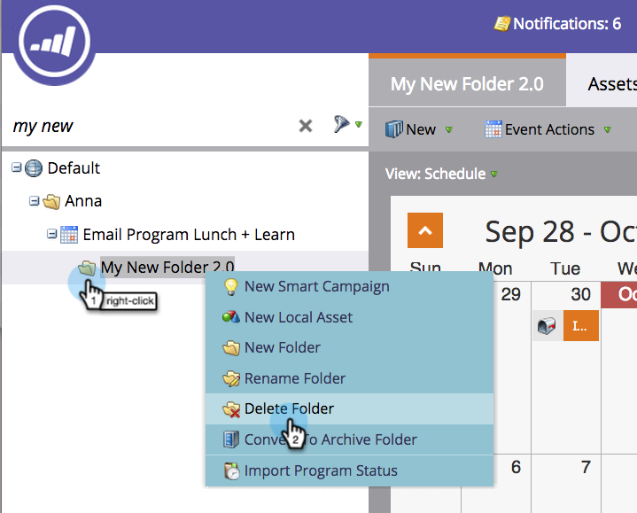
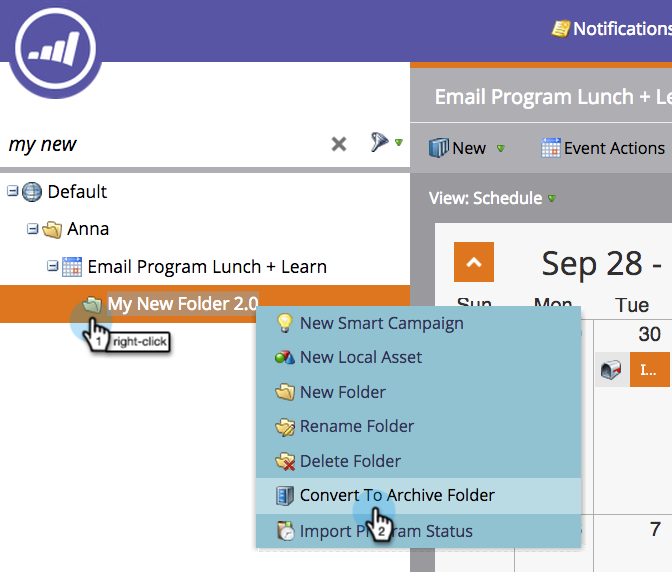

# Noções básicas sobre pastas {#understanding-folders}

As pastas em um programa podem ser usadas para organizar suas campanhas e ativos inteligentes. Eles são diferentes de [pastas de campanha](/help/marketo/product-docs/core-marketo-concepts/miscellaneous/create-new-campaign-folder.md).

## Criar uma pasta {#create-a-folder}

1. Vá para a **[!UICONTROL Atividades de marketing]** área.

   

1. Clique com o botão direito em um programa e selecione **[!UICONTROL Nova pasta]**.

   

1. Nomeie a nova pasta e pressione **[!UICONTROL Enter]**.

   

Ótimo! Agora você tem uma nova pasta para armazenar seus ativos locais.

## Renomear uma pasta {#rename-a-folder}

Não há problema em mudar de ideia.

1. Clique com o botão direito do mouse e selecione **[!UICONTROL Renomear pasta]**.

   

1. Digite um novo nome e pressione **[!UICONTROL Enter]**.

   

## Excluir uma pasta {#delete-a-folder}

>[!NOTE]
>
>Verifique se a pasta está vazia antes de excluí-la.

1. Clique com o botão direito do mouse e selecione **[!UICONTROL Excluir pasta]**.

   

## Arquivar uma pasta {#archive-a-folder}

No Marketo, você pode converter pastas existentes em pastas de arquivo. As pastas de arquivamento existem em Atividades de marketing, Banco de dados e Design Studio.

Ao arquivar uma pasta:

* A pasta e os ativos não estão mais visíveis nos resultados da pesquisa. Se você pesquisar um Programa ou Evento que esteja dentro de uma pasta arquivada, os resultados retornarão uma exibição recolhida da pasta arquivada
* Os ativos na pasta não aparecem mais na sugestão automática
* Modelos arquivados não estão disponíveis ao criar um email ou uma landing page no Design Studio
* Páginas arquivadas não podem ser usadas em grupos de teste de landing page

Funcionalidade que irá **não** alterar ao arquivar:

* A pesquisa global ainda encontra resultados em pastas arquivadas
* Um ativo que está em uso continuará a funcionar mesmo depois de ser arquivado
* Você pode usar um filtro para selecionar ativos arquivados para uso em relatórios
* Os ativos arquivados não estão desativados. Eles também devem ser desativados se você quiser que eles parem de funcionar
