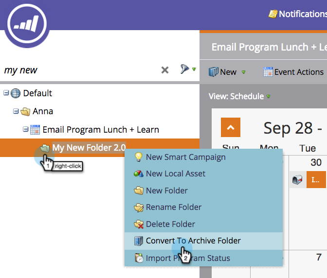

# Noções básicas sobre pastas {#understanding-folders}

As pastas em um programa podem ser usadas para organizar suas campanhas e ativos inteligentes. Estas são diferentes de [pastas de campanha](/help/marketo/product-docs/core-marketo-concepts/miscellaneous/create-new-campaign-folder.md).

## Criar uma pasta {#create-a-folder}

1. Acesse a área **[!UICONTROL Atividades de marketing]**.

   

1. Clique com o botão direito em um programa e selecione **[!UICONTROL Nova pasta]**.

   {width="600" zoomable="yes"}

1. Nomeie a nova pasta e pressione **[!UICONTROL Enter]**.

   {width="600" zoomable="yes"}

A nova pasta agora está pronta para seus ativos locais.

## Renomear uma pasta {#rename-a-folder}

1. Clique com o botão direito do mouse na pasta e selecione **[!UICONTROL Renomear Pasta]**.

   {width="600" zoomable="yes"}

1. Digite um novo nome e pressione **[!UICONTROL Enter]**.

   {width="600" zoomable="yes"}

## Excluir uma pasta {#delete-a-folder}

>[!NOTE]
>
>Verifique se a pasta está vazia antes de excluí-la.

1. Clique com o botão direito do mouse na pasta e selecione **[!UICONTROL Excluir Pasta]**.

   {width="600" zoomable="yes"}

## Arquivar uma pasta {#archive-a-folder}

No Marketo, você pode converter pastas existentes em pastas de arquivo. As pastas de arquivo existem em [!UICONTROL Atividades de marketing], [!UICONTROL Banco de dados] e [!UICONTROL Design Studio].

{width="600" zoomable="yes"}

Ao arquivar uma pasta:

* A pasta e os ativos não estão mais visíveis nos resultados da pesquisa. Se você pesquisar um Programa ou Evento que esteja dentro de uma pasta arquivada, os resultados retornarão uma exibição recolhida da pasta arquivada
* Os ativos na pasta não aparecem mais na sugestão automática
* Modelos arquivados não estão disponíveis ao criar um email ou uma landing page no Design Studio
* Páginas arquivadas não podem ser usadas em grupos de teste de landing page

Funcionalidade que **não** será alterada durante o arquivamento:

* A pesquisa global ainda encontra resultados em pastas arquivadas
* Você pode usar um filtro para selecionar ativos arquivados para uso em relatórios

### Desativar campanhas no arquivo {#disable-campaigns-archive}

Quando uma pasta ou programa é arquivado ou uma Campanha inteligente ativa é movida para uma pasta que já está arquivada, o Marketo Engage impede a execução das campanhas afetadas:

* **Campanhas acionadas** estão desativadas.
* **Campanhas em lote** têm suas execuções pendentes canceladas.
* **Campanhas executáveis** não têm estado de execução, portanto, nenhuma ação foi tomada.

**Ações com suporte**

As seguintes ações desativam campanhas:

* Arrastando e soltando uma **pasta** contendo campanhas ativas em uma pasta arquivada
* Arrastando e soltando um **programa** (qualquer tipo) contendo campanhas ativas em uma pasta arquivada
* Arrastando e soltando uma **única Campanha Inteligente** em uma pasta arquivada
* Clicar com o botão direito do mouse em **Mover** de uma única Campanha Inteligente para uma pasta arquivada
* Clicando com o botão direito do mouse em **Mover Pasta** em uma pasta que contém campanhas ativas para uma pasta arquivada
* Clicar com o botão direito do mouse em **Mover** em um programa que contém campanhas ativas para uma pasta arquivada
* Clicar com o botão direito do mouse em **Converter em Pasta Arquivada** em uma pasta para arquivá-la no local sem movê-la

>[!NOTE]
>
>Se uma Campanha inteligente dentro da pasta ou do programa que está sendo arquivado for referenciada em outro lugar (por exemplo, por meio de uma etapa de fluxo &quot;Solicitar campanha&quot;), o arquivamento será bloqueado para evitar a interrupção dessa outra campanha.
