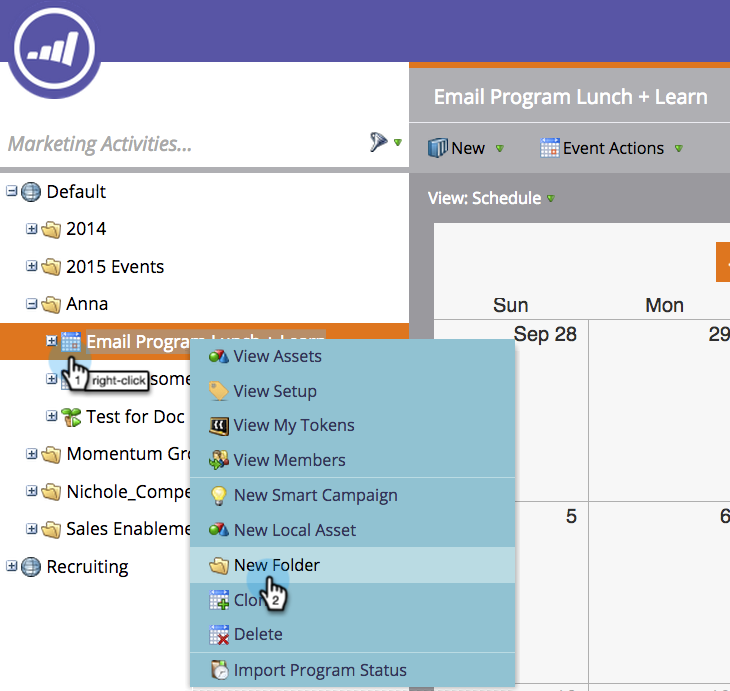

# Como entender pastas {#understanding-folders}

As pastas dentro de um programa podem ser usadas para organizar campanhas e ativos inteligentes. Elas são diferentes das pastas [de](create-new-campaign-folder.md)campanha.

## Criar uma pasta {#create-a-folder}

1. Vá para a área **Marketing Atividade** .

   

1. Clique com o botão direito do mouse em um programa e selecione **Nova pasta**.

   

1. Nomeie a nova pasta e pressione **Enter**.

   

Ótimo! Agora você tem uma nova pasta para armazenar seus ativos locais.

## Renomear uma pasta {#rename-a-folder}

Tudo bem mudar de ideia.

1. Clique com o botão direito do mouse na pasta e selecione **Renomear pasta**.

   

1. Digite um novo nome e pressione **Enter**.

   

   Et Volia! A pasta tem um novo nome.

## Excluir uma pasta {#delete-a-folder}

>[!NOTE]
>
>Verifique se a pasta está vazia antes de excluí-la.

1. Clique com o botão direito do mouse na pasta e selecione **Excluir pasta**.

   

   Pasta Adios!

## Arquivar uma pasta {#archive-a-folder}

No Marketo, você pode converter pastas existentes em pastas Arquivadas. As pastas de arquivamento existem no Marketing Atividade, no Banco de Dados e no Design Studio.

Ao arquivar uma pasta:

* A pasta e os ativos não estão mais visíveis nos resultados da pesquisa. Se você pesquisar por um Programa ou Evento que esteja dentro de uma pasta arquivada, os resultados retornarão uma visualização recolhida da pasta arquivada
* Os ativos na pasta não aparecem mais na sugestão automática
* Modelos arquivados não estão disponíveis ao criar um email ou landing page no Design Studio
* As páginas arquivadas não podem ser usadas em grupos de teste de landing page

Funcionalidade que **não** será alterada ao arquivar:

* A pesquisa global ainda encontra resultados em pastas arquivadas
* Um ativo que está em uso continuará a funcionar mesmo depois que for arquivado
* Você pode usar um filtro para selecionar ativos arquivados para uso em relatórios
* Os ativos arquivados não estão desativados. Eles também devem ser desativados se você quiser que eles parem de funcionar

