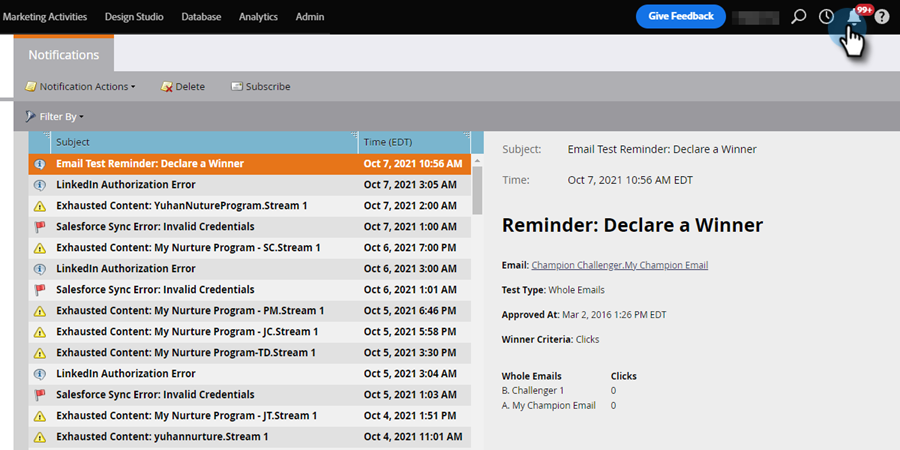

# Noções básicas sobre notificações {#understanding-notifications}

As notificações o mantêm atualizado sobre os eventos do sistema que ocorrem na sua assinatura do Marketo. Por exemplo, as notificações de falha de campanha informam sobre erros em suas campanhas inteligentes, e as notificações de sincronização de CRM alertam sobre problemas críticos encontrados com a sincronização de CRM, como permissões incorretas ou a inatividade da sincronização.

## Visão geral {#overview}

1. Novas notificações são exibidas na parte superior direita do Marketo.

   

1. Clique em Notificações para exibir todas as notificações.

   

## Inscrever-se em notificações {#subscribe-to-notifications}

Você pode assinar notificações para recebê-las em seu email.

1. Vá para Notificações e clique em **[!UICONTROL Assinar]**.

   

1. Selecione o Tipo de notificação e insira os endereços de email para os quais deseja enviar as notificações (separados por vírgula). Clique em **[!UICONTROL Assinar]** quando terminar.

   

>[!NOTE]
>
>A área **[!UICONTROL enviar para]** é somente para você inserir seu email; ela não mostrará uma lista de assinantes existentes.

Em alguns casos, uma notificação fornece um link &quot;Veja a lista completa&quot; para baixar um arquivo de valor separado por vírgula (CSV), por exemplo, o arquivo de Erros de sincronização do Microsoft Dynamics. A Marketo retém esses arquivos CSV por 30 dias. Se você tentar baixar o arquivo após 30 dias, receberá um erro 404.

>[!TIP]
>
>Deseja cancelar a inscrição de emails de notificação? Sem problemas. Basta clicar no link **[!UICONTROL cancelar inscrição das Notificações]** na parte inferior do email.
