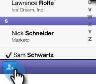

# Incluir pessoas em seu evento a partir do tablet {#check-people-into-your-event-from-your-tablet}

Quando as pessoas aparecem no evento, você pode encontrar suas informações no aplicativo. Após o check-in, eles são promovidos para o status Participou quando você sincroniza com o Marketo.

>[!IMPORTANT]
>
>Em 2 de outubro de 2023, o Adobe removeu o aplicativo Marketo Events de todas as lojas de aplicativos. Se você já tiver o aplicativo instalado no tablet/dispositivo móvel, poderá continuar usando-o por enquanto. Depois que a instância do Marketo Engage for migrada para a Identidade do Adobe para autenticação do Marketo, você não poderá mais acessar o aplicativo. [Saiba mais](https://nation.marketo.com/t5/product-discussions/marketo-events-app-and-marketo-moments-app-end-of-life/m-p/340712/highlight/true#M193869){target="_blank"}.

O aplicativo funciona da mesma forma no iPad e no Android, exceto pequenas diferenças de layout e design.

>[!PREREQUISITES]
>
>* Crie um evento no Marketo e preencha-o com Pessoas convidadas e registradas.

## Fazer check-in de convidados registrados {#check-in-registered-guests}

1. Toque no ícone do aplicativo no tablet iPad ou Android.

1. Toque **Logon** para iniciar o aplicativo Evento do Marketo.

   

1. Insira seu nome de usuário e senha do Marketo e clique em **Logon**.

   >[!NOTE]
   >
   >Você deve ter uma função com acesso ao banco de dados para ver as pessoas no aplicativo.

1. Selecione um **Evento**.

   

   >[!TIP]
   >
   >Somente programas de evento (com exceção de webinários) agendados uma semana antes e uma semana após a data de hoje são exibidos.

1. Na tela inicial, navegue até encontrar convidados registrados. Para localizar uma pessoa na lista, você pode:

   * Role para encontrar um nome
   * Insira um nome no campo de pesquisa
   * Ir para uma letra inicial específica de sobrenome tocando nela no lado direito da lista

   >[!NOTE]
   >
   >O processo é o mesmo no iPad e no Android, mas as telas são diferentes e os itens podem estar em locais diferentes. Este artigo apresenta a interface do iPad. Compare a tela do Android nesta seção para referência.

   **iPad**

   

   **Android**

   

1. Toque no nome selecionado e, no registro de pessoa, toque em **Check-in**.

   

O convidado agora tem um status Participou e recebe uma marca de seleção. O registro de pessoa é atualizado ao sincronizar com o Marketo. O contador vermelho no botão Sincronizar aumenta para mostrar o número de check-ins desde a última sincronização com o Marketo. O botão Sincronizar é diferente e está em um local diferente para iPad e Android:

**iPad**

**Android**

>[!TIP]
>
>Se uma pessoa foi convidada, mas não se registrou, procure pelo nome clicando em **Pesquisar no servidor**, logo abaixo da caixa Pesquisar. O status Convidado muda para **Participou** para o evento.

## Criar uma nova pessoa no tablet {#create-a-new-person-on-the-tablet}

Você pode adicionar convidados manualmente que não são pessoas existentes no banco de dados do Marketo. Eles terão check-in automático e serão adicionados ao banco de dados quando você sincronizar com o Marketo.

1. Clique em **Adicionar**.

   **iPad**

   

   **Android**

   

1. Preencha quantos campos de informações básicas puder e toque em **Concluído**.

   

   >[!NOTE]
   >
   >Você só pode usar os campos existentes. Você não pode criar arquivos personalizados.

   >[!CAUTION]
   >
   >Verifique novamente o endereço de email. Outros campos podem ser corrigidos posteriormente, mas o endereço de email é o método principal para entrar em contato com o convidado.

A nova pessoa é registrada como inscrita no evento e será adicionada ao banco de dados do Marketo com o status Participou quando você sincronizar com o Marketo.

## Reverter um check-in {#reverse-a-check-in}

Se você fez o check-in de uma pessoa por engano, _antes de sincronizar com o Marketo_, você pode reverter o status Participou.

1. Toque no nome na lista e, no registro de pessoa, toque em **Desfazer**.

   

   Tudo consertado!

## Editar um registro de pessoa no check-in {#edit-a-person-record-at-check-in}

Você pode adicionar e modificar informações do convidado, diretamente no evento!

1. Toque no nome na lista de pessoas e toque em **Editar**.

   

1. Edite e adicione informações aos campos e toque em **Concluído**.

   

   >[!NOTE]
   >
   >No Android, a variável **Concluído** pode estar oculto. Role para baixo para encontrá-lo.

As informações serão atualizadas quando você sincronizar o aplicativo com o Marketo.

## Sincronizar o aplicativo com o Marketo {#sync-the-app-with-marketo}

O aplicativo Eventos da Marketo funciona de forma independente até que você sincronize sua atividade de volta ao banco de dados do Marketo. É melhor sincronizar o mais rápido possível após o último check-in. O tablet deve estar conectado à Internet.

>[!CAUTION]
>
>Após a sincronização, não é possível reverter um check-in do aplicativo.

1. No tablet, abra o aplicativo e navegue até o evento.

1. Toque **Sincronizar**.

   Seu evento é atualizado com novos check-ins no banco de dados do Marketo. O contador vermelho no botão Sincronizar apaga, até que você marque outra pessoa em.

   Por motivos de segurança, você deve sair do aplicativo Eventos da Marketo depois de concluir a sincronização.

## Trabalhar com acesso limitado à Internet {#working-with-limited-internet-access}

Alguns locais têm péssimo acesso à Internet. Você precisa de uma boa conexão para:

* Baixe e instale o aplicativo
* Login
* Selecionar um evento
* Sincronizar o aplicativo com o Marketo

Se você estiver preocupado com o acesso à Internet no local, convém fazer logon no aplicativo Eventos da Marketo e selecionar seu evento com antecedência, em um local com forte acesso à Internet. Dessa forma, você ainda pode usar o aplicativo offline. Em seguida, ao recuperar uma conexão com a Internet, sincronize imediatamente com o banco de dados do Marketo.

>[!TIP]
>
>Se você não tiver uma conexão com a Internet, ainda poderá criar uma nova pessoa para fazer o check-in. Ele se reconciliará com a pessoa existente ao sincronizar o aplicativo.

>[!NOTE]
>
>O aplicativo encerra a sessão automaticamente após oito horas de inatividade.
