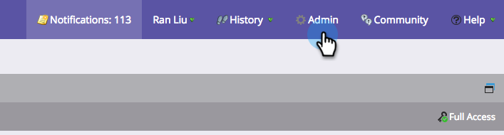

# Conceder aos usuários acesso ao aplicativo de check-in {#grant-users-access-to-the-check-in-app}

O Marketo tem uma função de usuário especial para o aplicativo de check-in de eventos. Veja como criar uma nova função com permissão para usar o aplicativo.

## Criar uma nova função de usuário para dispositivos móveis {#create-a-new-user-role-for-mobile}

1. Clique em **Admin**.

   

1. Clique em **Usuários e funções**.

   

1. Clique em **Funções** e clique em **Nova Função**.

   

1. Digite um nome para a nova função e uma descrição opcional. Verifique a **Acessar aplicativo móvel** e clique em **Criar**.

   

   A nova função está pronta para ser atribuída quando você convida pessoas para usar o aplicativo tablet.

## Convidar novos usuários para o aplicativo de check-in {#invite-new-users-for-the-check-in-app}

1. Clique em **Usuários** guia.

   

1. Clique em **Convidar novo usuário**.

   

1. Insira as informações do novo usuário. Marque as caixas de seleção de todas as funções apropriadas e a nova função com a permissão para acessar o aplicativo móvel. Clique em **Convidar** quando terminar.

   

   >[!CAUTION]
   >
   >Os usuários que não têm acesso ao banco de dados não podem ver nenhuma pessoa no aplicativo.

   >[!TIP]
   >
   >Para usuários existentes, você pode criar uma nova função ou adicionar a permissão de Aplicativo móvel do Access à função atual.

O usuário receberá um email informando que tem acesso ao aplicativo de check-in.
