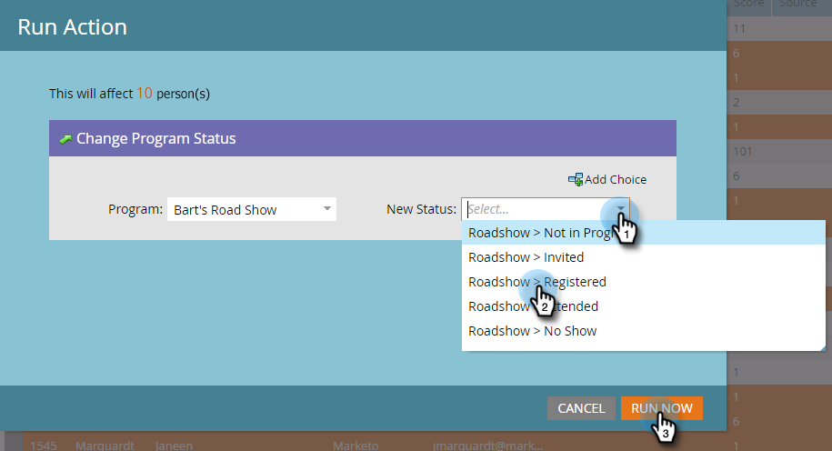

# Prepare-se para o seu evento {#prepare-for-your-event}

Há várias coisas que você precisa fazer para se preparar para o evento.

>[!IMPORTANT]
>
>Em 2 de outubro de 2023, o Adobe removeu o aplicativo Marketo Events de todas as lojas de aplicativos. Se você já tiver o aplicativo instalado no tablet/dispositivo móvel, poderá continuar usando-o por enquanto. Depois que a instância do Marketo Engage for migrada para a Identidade do Adobe para autenticação do Marketo, você não poderá mais acessar o aplicativo. [Saiba mais](https://nation.marketo.com/t5/product-discussions/marketo-events-app-and-marketo-moments-app-end-of-life/m-p/340712/highlight/true#M193869){target="_blank"}.

## Criar uma nova função do Marketo {#create-a-new-marketo-role}

O Marketo tem uma função de usuário especial para o aplicativo de check-in de eventos. [Criar uma nova função do Marketo](/help/marketo/product-docs/core-marketo-concepts/mobile-apps/event-check-in/grant-users-access-to-the-check-in-app.md) para usuários do iPad ou Android, com permissão para acessar o aplicativo móvel.

## Convidar novos usuários do Tablet para o evento {#invite-new-tablet-users-to-the-event}

[Convidar novos usuários do tablet para o evento](/help/marketo/product-docs/core-marketo-concepts/mobile-apps/event-check-in/grant-users-access-to-the-check-in-app.md) e atribua a eles a nova função.

## Criar um novo programa de evento do Marketo {#create-a-new-marketo-event-program}

[Criar um novo programa de evento do Marketo](/help/marketo/product-docs/demand-generation/events/understanding-events/create-a-new-event-program.md) para capturar o status dos membros da sua equipe à medida que avançam em diferentes estágios e obter medidas precisas do ROI de suas iniciativas de marketing.

## Especificar as datas do evento {#specify-the-event-dates}

É muito fácil definir as datas dos seus eventos.

1. Clique no evento no cronograma e defina a data e a hora de início e término.

   

1. Deslizar sobre para alterar **Tentativa** para **Confirmado**.

   

   >[!CAUTION]
   >
   >Se a data do evento for anterior ou posterior à data atual em mais de uma semana, o evento não aparecerá no aplicativo. **Dica**: para testá-lo, defina temporariamente as datas para dentro de uma semana a partir de hoje. Lembre-se de retornar o evento às datas corretas após testá-lo.

## Adicionar pessoas ao seu evento {#add-people-to-your-event}

Agora que você sabe o *quando*, é hora de adicionar o *quem*.

1. Se você já tiver uma lista de pessoas, em Meu Marketo, clique no link **Banco de dados** bloco.

   

1. Selecione uma lista com pessoas e clique no botão **Pessoas** guia.

   

1. Selecione as pessoas para o seu evento na lista. Uso **Ctrl** (ou **Comando** em uma Mac) para clicar em várias pessoas, ou **Selecionar tudo** para marcar todos eles.

   

1. Clique em **Ações da pessoa**, passe o mouse sobre **Programas** e selecione **Alterar status do programa**.

   

1. Clique em **Programa** e selecione o evento.

   

1. Clique em **Novo Status** e selecione **Roadshow > Registrado**. Clique em **Executar agora**.

   

1. Uma pequena janela exibe o progresso...

   

1. ... e indica quando a tarefa está concluída.

   

   As pessoas selecionadas agora estão em seu evento, prontas para check-in usando o aplicativo tablet no chão da feira de negócios.
