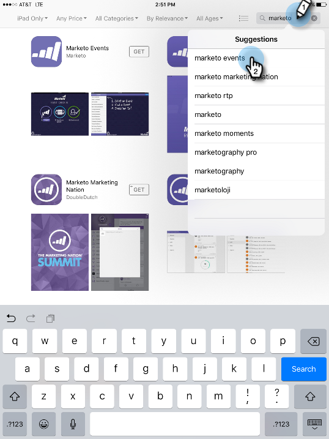

# Configurar o iPad ou o tablet Android {#set-up-the-ipad-or-android-tablet}

Para obter uma experiência suave no dia do evento, prepare seu iPad ou tablet Android e teste o aplicativo Eventos de marketing antes do evento.

Depois de criar o evento no Marketo, ele é carregado no aplicativo iPad ou Android para Eventos de marketing quando você faz logon, se:

* A conta tem acesso ao seu banco de dados
* O evento é programado em uma data no período que start uma semana antes e termina uma semana depois da data atual
* O evento foi criado no canal apropriado (por exemplo, Roadshow)

>[!NOTE]
>
>Você deve estar conectado à Internet para baixar aplicativos.

## Baixe e instale os Eventos de marketing no aplicativo iPad {#download-and-install-the-marketo-events-ipad-app}

Se seu iPad ainda não tiver o aplicativo Eventos Marketo instalado, veja como obtê-lo.

1. Abra o iPad e inicie a App Store.

   

1. Na caixa de pesquisa, digite **Marketo** e, em Sugestões, toque **marketing em eventos**.

   

1. Siga os procedimentos para baixar e instalar o aplicativo em seu iPad.

## Baixe e instale os Eventos de marketing no aplicativo Android {#download-and-install-the-marketo-events-android-app}

Se o seu tablet Android ainda não tiver o aplicativo Eventos Marketo instalado, veja como obtê-lo.

1. Abra o tablet e toque no aplicativo** Google Play Store**.
1. Na caixa Pesquisar, digite **Marketo** e toque em **Return**.
1. Nos resultados da pesquisa, toque no aplicativo **Eventos de marketing**.

   

1. Siga os procedimentos para baixar e instalar o aplicativo em seu tablet.

## Confirmar credenciais de logon para usuários de iPad e Tablet {#confirm-login-credentials-for-ipad-and-tablet-users}

Antes de atribuir iPads ou tablets à equipe de apresentação comercial, confirme se as credenciais de logon que eles usarão funcionam corretamente e se seu evento aparece na tela inicial do aplicativo.

1. Siga os procedimentos de logon para iPad ou tablet para fazer logon.
1. Confirme se seu evento aparece na tela inicial. Lembre-se, ele será exibido somente se suas datas estiverem dentro de uma semana antes e uma semana depois da data atual.

   

   >[!NOTE]
   >
   >Pode levar vários minutos após a criação de um novo evento para que ele seja exibido no iPad ou no aplicativo tablet. Se não for exibido, toque em **Logout** na tela Início, aguarde alguns minutos e faça logon novamente.

## Sincronize o aplicativo para preencher o Evento {#sync-the-app-to-populate-the-event}

Sincronize para ter certeza de que as pessoas que você adicionou estão lá.

1. Abra o evento no aplicativo iPad ou Android.
1. Procure as pessoas. Se não os vir, toque em **Sincronizar **para sincronizar o aplicativo e recarregar a lista das pessoas em Eventos.

   **iPad**

   

   **Android**

   

## Confirmar se os check-ins estão funcionando {#confirm-check-ins-are-working}

Certifique-se de confirmar se os check-ins estão funcionando no iPad ou no tablet antes do evento.

1. No aplicativo, [verifique um lead de teste em](check-people-into-your-event-from-your-tablet.md).
1. Toque no ícone **Sincronizar** para sincronizar o aplicativo.
1. No Marketo, abra seu evento e clique em **Membros**.

   

1. Confirme se o status da pessoa foi alterado para **Participado** e se Êxito foi verificado.

   

   >[!TIP]
   >
   >Use-se como a pessoa de teste.

