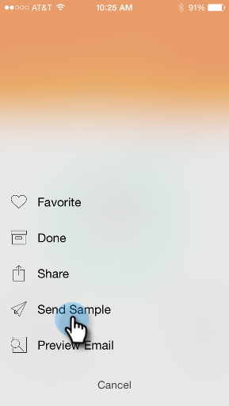

# Noções básicas sobre cartões do programa de email {#understanding-email-program-cards}

Use o Marketo Moments para exibir seus Programas de email do telefone ou do iPad.

>[!IMPORTANT]
>
>Em 2 de outubro de 2023, a Adobe removeu o aplicativo Marketo Moments de todas as lojas de aplicativos. Se você já tiver o aplicativo instalado no tablet/dispositivo móvel, poderá continuar usando-o por enquanto. Depois que sua instância do Marketo Engage for migrada para a Adobe Identity para autenticação do Marketo, você não poderá mais acessar o aplicativo. [Saiba mais](https://nation.marketo.com/t5/product-discussions/marketo-events-app-and-marketo-moments-app-end-of-life/m-p/340712/highlight/true#M193869){target="_blank"}.

## Cartões do programa de email {#email-program-cards}

Ao tocar em qualquer cartão do Programa de email, você pode:

* [Tornar um email favorito](/help/marketo/product-docs/core-marketo-concepts/mobile-apps/marketo-moments/working-with-moments/creating-a-favorite.md)
* [Marcar um email como concluído](/help/marketo/product-docs/core-marketo-concepts/mobile-apps/marketo-moments/working-with-moments/marking-it-done.md)
* [Compartilhar um cartão de ponto por email](/help/marketo/product-docs/core-marketo-concepts/mobile-apps/marketo-moments/working-with-moments/sharing-a-moment.md)

Em um cartão de programa de email para um email que ainda não foi enviado, você encontrará informações sobre o status e o público-alvo desse programa de email.

Depois que o email é enviado, o cartão exibe outras informações valiosas, incluindo o número de emails entregues, as ações dos destinatários e um link para a lista inteligente usada na campanha.

## Confirmação de um cartão de email {#confirming-an-email-card}

1. Para confirmar um cartão de email não confirmado, toque no menu de três pontos.

   

1. Toque em **[!UICONTROL Confirmar]**.

   

1. Toque em **[!UICONTROL Confirmar]** para concluir o trabalho ou **[!UICONTROL Não importa]** se tiver dúvidas.

   

   >[!NOTE]
   >
   >Agora seu cartão ficará laranja!

## Cancelando o envio de um cartão de e-mail {#canceling-an-email-card-send}

1. Se decidir não enviar o email confirmado, toque no menu de três pontos.

   

1. Toque em **[!UICONTROL Cancelar envio]**.

   

## Reprogramando um cartão de email {#rescheduling-an-email-card}

Você pode reagendar cartões de email confirmados ou não confirmados.

>[!NOTE]
>
>Para emails já confirmados, é necessário cancelar o email primeiro (veja abaixo).

1. Para reagendar um email, toque no menu de três pontos.

   

1. Toque em **[!UICONTROL Reagendar]**.

   

1. Selecione uma data no calendário e toque em **[!UICONTROL Reagendar]**.

   

   Desde que você tenha um serviço sem fio, é possível reagendar a partir de qualquer lugar!

## Envio de uma amostra {#sending-a-sample}

Você pode compartilhar uma amostra de um momento de email diretamente com alguém.

1. Abra o menu Cartão.

   

1. Toque em **[!UICONTROL Enviar Amostra]**.

   

1. Digite um endereço de email e clique em **[!UICONTROL Enviar Amostra]**.

   

## Pré-visualização de um email {#previewing-an-email}

Clique com o botão direito do mouse em um cartão de email para pré-visualizá-lo.

1. Toque em **[!UICONTROL Visualizar Email]**.

   

   Dessa forma, você sabe que seu email é perfeito antes de puxar o gatilho!

   

>[!MORELIKETHIS]
>
>* [Noções básicas sobre o Marketo Moments](/help/marketo/product-docs/core-marketo-concepts/mobile-apps/marketo-moments/understanding-moments/understanding-marketo-moments.md)
>* [Compreendendo os Cartões de Eventos](/help/marketo/product-docs/core-marketo-concepts/mobile-apps/marketo-moments/understanding-moments/understanding-event-cards.md)
>* [Compreendendo os Cartões do Analytics](/help/marketo/product-docs/core-marketo-concepts/mobile-apps/marketo-moments/understanding-moments/understanding-analytics-cards.md)
