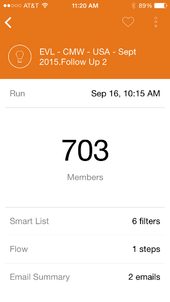

# Noções básicas sobre o Marketo Moments {#understanding-marketo-moments}

A força do Marketo agora está literalmente nas suas mãos! Visualize e reagende e-mails diretamente de seu celular ou iPad.

>[!IMPORTANT]
>
>Em 2 de outubro de 2023, o Adobe removeu o aplicativo Marketo Moments de todas as lojas de aplicativos. Se você já tiver o aplicativo instalado no tablet/dispositivo móvel, poderá continuar usando-o por enquanto. Depois que a instância do Marketo Engage for migrada para a Identidade do Adobe para autenticação do Marketo, você não poderá mais acessar o aplicativo. [Saiba mais](https://nation.marketo.com/t5/product-discussions/marketo-events-app-and-marketo-moments-app-end-of-life/m-p/340712/highlight/true#M193869){target="_blank"}.

>[!NOTE]
>
>_Acessar aplicativos móveis_ a permissão é necessária. Entre em contato com o administrador do Marketo para [atualizar sua função](/help/marketo/product-docs/administration/users-and-roles/managing-user-roles-and-permissions.md).

## Fluxos {#streams}

Aqui estão os diferentes fluxos em Moments.

>[!NOTE]
>
>**Definição**
>
>* [!UICONTROL Momentos]: Tudo que acabou de ser executado ou está prestes a ser executado é inserido aqui.
>* [!UICONTROL Favoritos]: Qualquer item que você marcar como favorito será inserido aqui.
>* [!UICONTROL Mais tarde]: Qualquer coisa que aconteça depois desse momento entra aqui.
>* [!UICONTROL Concluído]: Qualquer item que tenha terminado de ser executado ou tenha sido marcado como concluído será inserido aqui.

OK, agora que já temos isso fora do caminho, vamos dar uma olhada no Marketo Moments em um telefone!

## Três tipos de cartões {#three-kinds-of-cards}

O Marketo Moments oferece três cartões diferentes para acompanhar o progresso do email:

**[!UICONTROL No convés]** - Este e-mail está prestes a ser enviado. É a última chance de pré-visualizá-la, enviar uma amostra ou até mesmo cancelá-la, se necessário.

**[!UICONTROL Batimento cardíaco]** - Ei - este e-mail está sendo entregue agora! E aqui estão estatísticas também. Vá em frente e compartilhe.

**[!UICONTROL Resultados]** - Veja como foi o email. Depois que o email terminar de ser executado, o cartão Resultados exibe a pontuação de engajamento e outras estatísticas.

## Fluxo de momentos {#moments-stream}

Ao abrir o aplicativo ou tocar pela primeira vez **[!UICONTROL Momentos]** no menu, os cartões relevantes são exibidos primeiro. Cada uma contém informações sobre essa iniciativa de marketing específica e seu desempenho geral.

Tocar no cartão abre uma tela de detalhes.

>[!NOTE]
>
>Os cartões laranja são confirmados; os cinza são provisórios.

Tocar nos três pontos abre um menu de ação de cartão.

Ótimo! Agora, é possível fazer algo acontecer tocando em:

>[!NOTE]
>
>**Definição**
>
>* [!UICONTROL Favorito]: É fácil prestar atenção às coisas mais oportunas e importantes se você as tornar favoritas.
>* [!UICONTROL Concluído]: Concluído o retira da exibição de Momentos do Marketo (mas o deixa no Marketo, em segurança e som).
>* [!UICONTROL Compartilhar]: envie uma imagem para motivar ou parabenizar sua equipe.
>* [!UICONTROL Enviar amostra] (somente email): use essa opção para permitir que outras pessoas verifiquem a aparência dos seus emails antes de você enviá-los.
>* [!UICONTROL Visualizar email] (somente emails): sempre é uma boa ideia verificar seus emails com antecedência.

## Momentos posteriores {#later-moments}

A seção Posteriormente mostra as atividades futuras.

1. Comece tocando no menu de hambúrguer.

   

1. Toque **[!UICONTROL Mais tarde]**.

   

   Consulte uma lista de atividades futuras.

   

## Cartões do programa de email {#email-program-cards}

Os cartões do programa de email mostram coisas importantes como cronograma, público-alvo, status e outras coisas úteis, mesmo quando você está em horário de almoço.

## Cartões de evento {#event-cards}

Para eventos, você verá o número total de membros e seus status.

## Cartões do Analytics {#analytics-cards}

Os cartões Momento do Analytics mostram como seus emails e eventos estão se saindo mensalmente nos últimos seis meses, para:

1. Clientes potenciais adquiridos
1. Novos leads
1. Cancelamentos de inscrição

## Cartões de execução de campanha inteligente {#smart-campaign-run-cards}

Os cartões de campanha inteligentes representam uma única execução de uma campanha. Um novo cartão é exibido toda vez que a campanha inteligente é executada. Toque para ver os filtros da lista inteligente usados, o fluxo da campanha e cada um dos emails usados na campanha.

## Confirmar ou cancelar uma ação {#confirm-or-cancel-an-action}

Em cada etapa do caminho, você pode confirmar ou cancelar uma ação. Se mudar de ideia, basta tocar **[!UICONTROL Não importa]**.

## Versões suportadas {#supported-versions}

O Marketo Moments é compatível com estas versões de sistema operacional:

* [!DNL Apple] iOS 8.0 e superior.
* [!DNL Android] versão 4.1 e superior (basicamente Jellybean e superior).

Pronto para aprender mais?

>[!MORELIKETHIS]
>
>* [Compreensão dos cartões do programa de email](/help/marketo/product-docs/core-marketo-concepts/mobile-apps/marketo-moments/understanding-moments/understanding-email-program-cards.md)
>* [Compreensão de cartões de evento](/help/marketo/product-docs/core-marketo-concepts/mobile-apps/marketo-moments/understanding-moments/understanding-event-cards.md)
>* [Compreensão de cartões do Analytics](/help/marketo/product-docs/core-marketo-concepts/mobile-apps/marketo-moments/understanding-moments/understanding-analytics-cards.md)
>* [Compreensão de cartões do Smart Campaign](/help/marketo/product-docs/core-marketo-concepts/mobile-apps/marketo-moments/understanding-moments/understanding-smart-campaign-cards.md)
