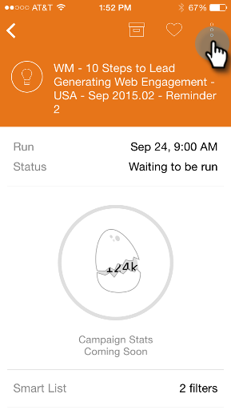

# Como entender os cartões de campanha inteligente {#understanding-smart-campaign-cards}

Use os Momentos do Marketo para visualizar cada execução de suas campanhas inteligentes de seu smartphone ou iPad. O cartão de campanha inteligente Moments do Marketo representa uma única execução de uma campanha; um novo cartão é exibido sempre que a campanha inteligente é executada. Os cartões de campanha inteligentes são marcados com uma lâmpada no canto superior esquerdo.

Para futuras campanhas inteligentes programadas, mas ainda não executadas, o cartão de Momentos do Marketo ainda não exibe as estatísticas da campanha. Eles aparecerão em uma versão futura.

## Cartões de campanha inteligente {#smart-campaign-cards}

1. Toque no cartão para abrir o cartão de detalhes.

   

1. O cartão de detalhes fornece acesso a informações sobre os filtros Smart List, Fluxo e Resumo de email.

1. Toque em **Smart List**.

   

1. Os filtros usados pela lista inteligente são mostrados aqui.

   

1. Toque em **Fluxo**.

   

1. Agora, você verá o fluxo da Campanha inteligente. Essa campanha tem apenas uma etapa do fluxo, mas pode haver várias.

   

1. Clique em **Resumo de email**.

   

1. Agora, é possível ver a resposta do recipient em cada email, por número e porcentagem.

   

1. Vê aqueles dois pontos no fundo? Eles indicam que há dois emails conectados a essa campanha inteligente. Para visualizar os resultados do outro email, passe a tela para a esquerda. Veja os resultados do segundo email.

   

   >[!NOTE]
   >
   >Observe que o outro ponto está destacado agora.

## Criação de amostras de email e visualizações {#creating-email-samples-and-previews}

É uma boa ideia dar uma olhada em um e-mail antes que ele saia. Ou envie uma amostra para outra pessoa para ter um segundo conjunto de olhos nela.

1. Toque no menu de ação de três pontos em um email.

   

1. Toque em [Enviar amostra](/help/marketo/product-docs/core-marketo-concepts/mobile-apps/marketo-moments/working-with-moments/sending-a-sample.md) ou [Visualizar email](/help/marketo/product-docs/core-marketo-concepts/mobile-apps/marketo-moments/working-with-moments/previewing-an-email.md) (clique nesses links para obter detalhes).

   

## Confirmação de uma execução de campanha inteligente {#confirming-a-smart-campaign-run}

Os cartões para campanhas inteligentes não confirmadas são cinza até que você os confirme. Então elas ficam laranja.

1. Para confirmar um cartão de campanha inteligente não confirmado, toque no menu de ação de três pontos.

   

1. Toque em **Confirmar**.

   

1. Toque em **Confirmar** para concluir o trabalho ou em **Nunca pensar** se tiver pensamentos secundários.

   

   >[!NOTE]
   >
   >Agora seu cartão vai ficar laranja!

## Cancelar uma execução de campanha inteligente {#canceling-a-smart-campaign-run}

Você pode cancelar uma execução de campanha inteligente confirmada e agendada.

1. Toque no menu de ação de três pontos.

   

1. Toque em **Cancelar Execução**.

   

1. Toque em **Cancelar Execução**. Se você decidir no último minuto não cancelar a execução, toque em **Never Mind** e a campanha inteligente será executada conforme agendado.

   

## Reagendamento de uma Campanha Inteligente {#rescheduling-a-smart-campaign}

Você pode reprogramar uma campanha inteligente confirmada que ainda não foi executada.

1. Toque no menu de ação de três pontos.

   

1. Toque em **Reprogramar**.

   

1. Selecione uma data no calendário e toque em **Reprogramar**.

   

   Pedaço de bolo!

## Outras ações de campanha inteligente {#other-smart-campaign-actions}

Assim como em outros cartões de Momentos do Marketo, você pode tocar nos três pontos em qualquer cartão do Smart Campaign ou em um cartão de detalhes para:

* [Torne-o um favorito](/help/marketo/product-docs/core-marketo-concepts/mobile-apps/marketo-moments/working-with-moments/creating-a-favorite.md)
* [Marque como concluído](/help/marketo/product-docs/core-marketo-concepts/mobile-apps/marketo-moments/working-with-moments/marking-it-done.md)
* [Compartilhar](/help/marketo/product-docs/core-marketo-concepts/mobile-apps/marketo-moments/working-with-moments/sharing-a-moment.md)

>[!NOTE]
>
>Você também pode tocar no ícone **Compartilhar** em um cartão do Smart Campaign para compartilhar e nos ícones **Concluído** e **Favorito** no cartão de detalhes.

## Exclua rapidamente um cartão de campanha inteligente {#quickly-delete-a-smart-campaign-card}

Se você tiver um cartão que não precisa mais, talvez um que tenha usado para testar, você pode se livrar dele com um deslize rápido para a esquerda ou para a direita.
