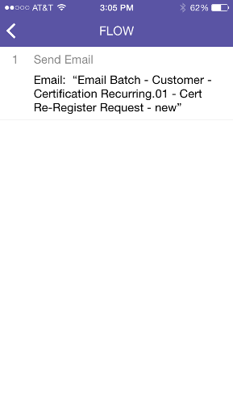

# Noções básicas sobre cartões de campanha inteligente {#understanding-smart-campaign-cards}

Use o Marketo Moments para exibir cada execução das Campanhas inteligentes do seu smartphone ou iPad. O cartão Campanha inteligente do Marketo Moments representa uma única execução de uma campanha; um novo cartão é exibido sempre que a Campanha inteligente é executada. Os cartões Smart Campaign estão marcados com uma lâmpada no canto superior esquerdo.

>[!IMPORTANT]
>
>Em 2 de outubro de 2023, a Adobe removeu o aplicativo Marketo Moments de todas as lojas de aplicativos. Se você já tiver o aplicativo instalado no tablet/dispositivo móvel, poderá continuar usando-o por enquanto. Depois que sua instância do Marketo Engage for migrada para a Adobe Identity para autenticação do Marketo, você não poderá mais acessar o aplicativo. [Saiba mais](https://nation.marketo.com/t5/product-discussions/marketo-events-app-and-marketo-moments-app-end-of-life/m-p/340712/highlight/true#M193869){target="_blank"}.

Para campanhas inteligentes futuras que estão programadas, mas ainda não foram executadas, o cartão Momentos da Marketo ainda não exibe nenhuma estatística da campanha. Eles aparecerão em uma versão futura.

## Cartões de campanha inteligentes {#smart-campaign-cards}

1. Toque no cartão para abrir o cartão de detalhes.

   

1. O cartão de detalhes fornece acesso às informações sobre os filtros [!UICONTROL Lista Inteligente], [!UICONTROL Fluxo] e [!UICONTROL Resumo de Email].

1. Toque em **[!UICONTROL Smart List]**.

   

1. Os filtros usados pela lista inteligente são mostrados aqui.

   

1. Toque em **[!UICONTROL Fluxo]**.

   

1. Agora, você verá o fluxo da Campanha inteligente. Esta campanha tem apenas uma etapa de fluxo, mas pode haver várias.

   

1. Clique em **[!UICONTROL Resumo do email]**.

   

1. Agora, você pode ver a resposta do recipient a cada email, por número e porcentagem.

   

1. Vê aqueles dois pontos na base? Eles indicam que há dois emails conectados a essa Campanha inteligente. Para visualizar os resultados do outro email, passe o dedo para a tela à esquerda. Estes são os resultados do segundo email.

   

   >[!NOTE]
   >
   >Observe que o outro ponto é realçado agora.

## Criação de amostras e visualizações de email {#creating-email-samples-and-previews}

É uma boa ideia dar uma olhada em um email antes que ele seja enviado. Ou envie uma amostra para outra pessoa para obter um segundo conjunto de olhos nela.

1. Toque no menu de ação de três pontos em um email.

   

1. Toque em [[!UICONTROL Enviar Amostra]](/help/marketo/product-docs/core-marketo-concepts/mobile-apps/marketo-moments/working-with-moments/sending-a-sample.md) ou [[!UICONTROL Visualizar Email]](/help/marketo/product-docs/core-marketo-concepts/mobile-apps/marketo-moments/working-with-moments/previewing-an-email.md) (clique nestes links para obter detalhes).

   

## Confirmação de uma execução da campanha inteligente {#confirming-a-smart-campaign-run}

Os cartões para Campanhas inteligentes não confirmadas ficam em cinza até que você os confirme. Então, eles ficam alaranjados.

1. Para confirmar um cartão do Smart Campaign não confirmado, toque no menu de ação de três pontos.

   

1. Toque em **[!UICONTROL Confirmar]**.

   

1. Toque em **[!UICONTROL Confirmar]** para concluir o trabalho ou **[!UICONTROL Não importa]** se tiver dúvidas.

   

   >[!NOTE]
   >
   >Agora seu cartão ficará laranja!

## Cancelar uma execução de campanha inteligente {#canceling-a-smart-campaign-run}

Você pode cancelar uma execução confirmada e programada do Smart Campaign.

1. Toque no menu de ação de três pontos.

   

1. Toque em **[!UICONTROL Cancelar Execução]**.

   

1. Toque em **Cancelar Execução**. Se você decidir no último minuto não cancelar a execução, toque em **Não importa**, e a Campanha inteligente será executada conforme agendado.

   

## Reprogramar uma campanha inteligente {#rescheduling-a-smart-campaign}

Você pode reagendar uma Campanha inteligente confirmada que ainda não foi executada.

1. Toque no menu de ação de três pontos.

   

1. Toque em **[!UICONTROL Reagendar]**.

   

1. Selecione uma data no calendário e toque em **[!UICONTROL Reagendar]**.

   

   Pedaço de bolo!

## Outras ações do Smart Campaign {#other-smart-campaign-actions}

Assim como em outros cartões Marketo Moments, você pode tocar nos três pontos em qualquer cartão do Smart Campaign ou cartão de detalhes para:

* [Tornar um favorito](/help/marketo/product-docs/core-marketo-concepts/mobile-apps/marketo-moments/working-with-moments/creating-a-favorite.md)
* [Marcar como concluído](/help/marketo/product-docs/core-marketo-concepts/mobile-apps/marketo-moments/working-with-moments/marking-it-done.md)
* [Compartilhá-lo](/help/marketo/product-docs/core-marketo-concepts/mobile-apps/marketo-moments/working-with-moments/sharing-a-moment.md)

>[!NOTE]
>
>Você também pode tocar no ícone **[!UICONTROL Compartilhar]** em um cartão do Smart Campaign para compartilhar, e nos ícones **[!UICONTROL Concluído]** e **[!UICONTROL Favorito]** no cartão de detalhes.

## Excluir rapidamente um cartão de campanha inteligente {#quickly-delete-a-smart-campaign-card}

Se você tiver um cartão que não precisa mais, talvez um que tenha usado para testes, poderá se livrar dele com um rápido deslizamento para a esquerda ou para a direita.
