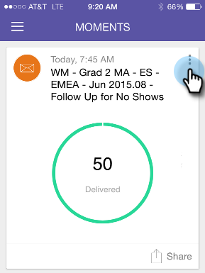

# Criar um favorito {#creating-a-favorite}

Marque um cartão como favorito para referência futura.

>[!IMPORTANT]
>
>Em 2 de outubro de 2023, a Adobe removeu o aplicativo Marketo Moments de todas as lojas de aplicativos. Se você já tiver o aplicativo instalado no tablet/dispositivo móvel, poderá continuar usando-o por enquanto. Depois que sua instância do Marketo Engage for migrada para a Adobe Identity para autenticação do Marketo, você não poderá mais acessar o aplicativo. [Saiba mais](https://nation.marketo.com/t5/product-discussions/marketo-events-app-and-marketo-moments-app-end-of-life/m-p/340712/highlight/true#M193869){target="_blank"}.

1. Abra o menu Cartão.

   

1. Toque em **[!UICONTROL Favorito]**.

   

   Isso é tudo!
