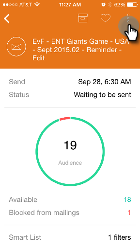

# Pré-visualização de email {#previewing-an-email}

Clique com o botão direito do mouse em um cartão de email para visualizá-lo, antes de puxar o acionador.

>[!IMPORTANT]
>
>Em 2 de outubro de 2023, o Adobe removeu o aplicativo Marketo Moments de todas as lojas de aplicativos. Se você já tiver o aplicativo instalado no tablet/dispositivo móvel, poderá continuar usando-o por enquanto. Depois que a instância do Marketo Engage for migrada para a Identidade do Adobe para autenticação do Marketo, você não poderá mais acessar o aplicativo. [Saiba mais](https://nation.marketo.com/t5/product-discussions/marketo-events-app-and-marketo-moments-app-end-of-life/m-p/340712/highlight/true#M193869){target="_blank"}.

1. Em um cartão de email, toque no menu de ação de três pontos.

   

1. Toque **[!UICONTROL Visualizar email]**.

   

1. Você pode exibir o email em seu dispositivo.

   

   >[!NOTE]
   >
   >Para enviar uma amostra diretamente da página Email Preview, toque no ícone de avião em papel no canto superior direito.
