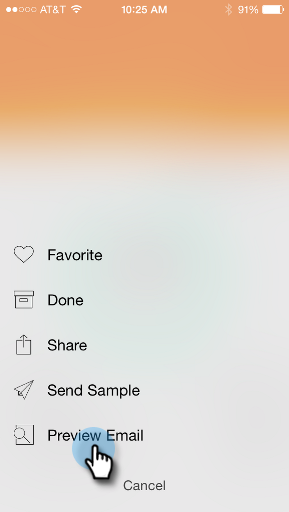

# Pré-visualização de email {#previewing-an-email}

Clique com o botão direito do mouse em um cartão de email para visualizá-lo, antes de puxar o acionador.

1. Em um cartão de email, toque no menu de ação de três pontos.

   

1. Toque **Visualizar email**.

   

1. Você pode exibir o email em seu dispositivo.

   

   >[!NOTE]
   >
   >Para enviar uma amostra diretamente da página Email Preview, toque no ícone de avião em papel no canto superior direito.

   Excelente!
