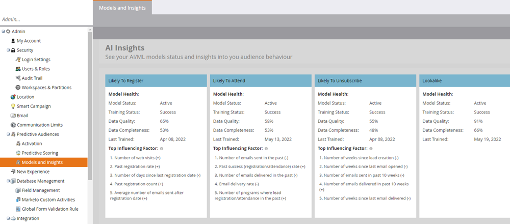

# Modelos e insights {#models-and-insights}

O desempenho de seus modelos depende da qualidade e da integridade dos dados de entrada. Consulte o principal fator de influência para cada um dos modelos de IA de probabilidade. Consulte também os principais fatores que resultam em registro de evento mais alto/mais baixo, participação no evento ou cancelamentos de inscrição.

>[!NOTE]
>
>Comportamentos marcados com (+) influenciam positivamente as previsões (e vice-versa).

Aqui está como avaliar seu modelo de saúde.

Navegue até a **[!UICONTROL Modelos e integridade dos dados]** seção em **[!UICONTROL Públicos preditivos]** no **[!UICONTROL Admin]** área da Marketo Engage. Aqui você verá todos os seus modelos e seus status.

* **Status do treinamento**: indica se o modelo está treinando ativamente (melhorando as previsões). O treinamento ocorre automaticamente a cada duas semanas. Todos os modelos que são _Processando_ O pode levar até 24 horas para ser concluído. Para qualquer _Failed_ modelos, contate [Suporte ao Marketo](https://nation.marketo.com/t5/Support/ct-p/Support){target="_blank"}.
* **Status da pontuação**: indica se o modelo está calculando previsões ativamente (porcentagens de probabilidade) para membros do programa.
* **Desempenho**: categorização da integridade do modelo com base na Integridade dos dados e na Qualidade dos dados (veja abaixo).
* **Integridade dos dados**: porcentagem de atributos de dados que estão presentes/completos.
* **Qualidade dos dados**: porcentagem de atributos que contêm dados válidos e utilizáveis.
