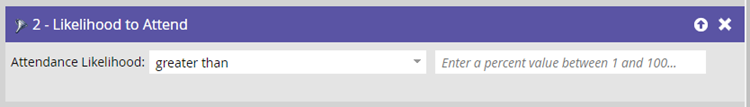

# Filtros preditivos {#predictive-filters}

Como parte do Predictive Audiences, o Marketo oferece um grupo de filtros baseados em IA/ML em Smart Lists nas Campanhas inteligentes.

>[!NOTE]
>
>Os filtros &quot;Probabilidade de participação&quot; e &quot;Probabilidade de registro&quot; só podem ser usados em Programas de evento. É possível usar as opções &quot;Probabilidade de cancelamento de inscrição&quot;, &quot;Semelhança de membros de programa&quot; e &quot;Semelhança de membros de lista inteligente&quot; em todos os tipos de programas.

## Probabilidade de participação {#likelihood-to-attend}

Esse filtro é usado para restringir efetivamente seu público-alvo. Isso ajuda a direcionar e convidar clientes potenciais com uma probabilidade maior de **participando** seu webinário ou evento. Observe que o &quot;Programa de probabilidade de participação&quot; será seu programa de evento atual.

## Probabilidade de registro {#likelihood-to-register}

Semelhante ao _Probabilidade de participação_ use esse filtro para restringir seu público-alvo e direcionar clientes potenciais que têm uma probabilidade maior de **registrando** para seu webinário ou evento.

## Probabilidade de cancelamento de inscrição {#likelihood-to-unsubscribe}

Isso filtra o público-alvo determinando se ele tem uma alta ou baixa probabilidade de cancelar a assinatura nas próximas duas semanas. Você pode usá-lo para direcionar condutores de alta fadiga de forma diferente e com mais eficiência. O limite de cancelamento de inscrição é dinâmico e orientado por um modelo de IA que considera vários atributos, incluindo o lead time no banco de dados e as atividades de lead.

>[!NOTE]
>
>Os filtros Probabilidade de participação/registro/cancelamento de inscrição devem ser usados junto com outros filtros padrão.

## Semelhança de Membros do Programa/Semelhança de Membros da Smart List {#lookalike-of-members}

Esses dois filtros ajudam você a expandir seu público-alvo atual direcionando leads adicionais que são semelhantes aos membros de outro programa ou lista inteligente. Os filtros Semelhantes consideram mais de 50 fatores, incluindo atributos de cliente potencial, atividade de email, atividade da Web e envolvimento.

Clique em **[!UICONTROL Adicionar Restrição]** para escolher os critérios de sucesso para os membros do(s) programa(s) selecionado(s).

Clique em **+** ícone para adicionar facilmente vários programas/Smart Lists a um filtro.

## Itens a Observar {#things-to-note}

* Você pode aplicar filtros preditivos a uma Campanha inteligente, mesmo se o programa principal for criado antes da ativação dos filtros preditivos.
* Os filtros preditivos não estão disponíveis para Campanhas de acionador.
* Não há suporte para clonagem ou movimentação de campanhas que contêm filtros preditivos.
* Você pode usar até 5 filtros preditivos em uma Smart List.
* Se o Marketo Engage encontrar um erro na avaliação de filtros preditivos, a execução da campanha será interrompida automaticamente e você receberá uma notificação na central de notificações da Marketo.
* Atualmente, os filtros preditivos têm um limite de entrada de 1 milhão de pessoas qualificadas.
* Você pode ter até 50 programas ativos com filtros preditivos.
