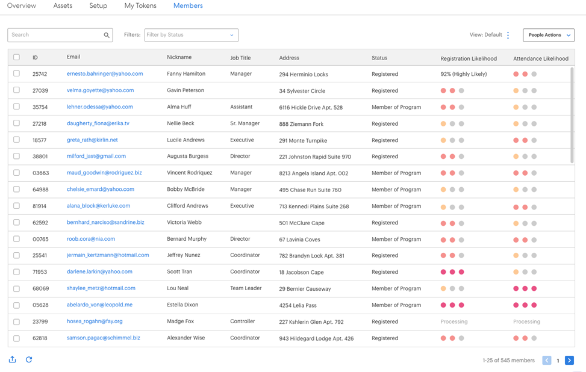

# Noções básicas sobre rastreamento de metas e registros projetados {#understanding-goal-tracking-and-projected-registrations}

Veja como rastrear o progresso de suas metas e entender as previsões da Marketo.

>[!PREREQUISITES]
>
>Para acessar a maioria desses recursos, habilite a [alternância de próxima geração](/help/marketo/product-docs/marketo-engage-modern-ux/toggle-switch.md){target="_blank"} para Programas de Evento.

>[!NOTE]
>
>Quando um programa de evento é criado na experiência do Marketo Classic, a data de início do evento assume o padrão da data de criação do evento. Como os registros projetados levam em conta o tempo antes da data de início de um evento, esses números podem não ser precisos se a data de início e a data de criação forem as mesmas (a menos que definidas intencionalmente).

## Rastreamento de metas e registros projetados

1. Você pode encontrar detalhes de rastreamento de metas na guia **[!UICONTROL Relatórios]** do seu programa de eventos. Neste exemplo específico, há 150 membros registrados até agora contra uma meta de 200 (75%).

   

Você também verá seus **[!UICONTROL Registros]** projetados. Passe o mouse sobre o ícone de informações para ver um detalhamento desse número por segmento de Probabilidade.

>[!NOTE]
>
>O gráfico Participou e Superior permanecerá vazio até o dia do evento.

Se você não ativou o switch de alternância, veja como ele aparecerá na interface do usuário de classe do Marketo:

1. Clique no botão de alternância Gráfico para alternar para um detalhamento de seus membros por probabilidade de registro. Você verá as porcentagens de registro atuais para cada segmento, em comparação à porcentagem média para esse segmento em seus programas anteriores.

   

Todos os membros (registrados e ainda não registrados) são categorizados com base em sua probabilidade de registro. Passe o mouse sobre o ícone de informações para ver como essas categorias de probabilidade são definidas.

>[!NOTE]
>
>Os números de previsão são atualizados a cada 24 horas até o dia do evento. Todos os membros listados como _Processando_ serão incluídos no próximo ciclo de cálculo.

## Programas semelhantes

Você pode obter alguns insights sobre seu evento atual observando o desempenho passado de programas semelhantes. Esta seção mostra até 5 programas semelhantes dos últimos 6 meses, com o número/porcentagem de membros que foram _Registrados_ ou superior.

Ao calcular programas semelhantes, incluímos os seguintes fatores, entre outros:

* Tipo de programa
* Canal do programa
* Tamanho do público-alvo
* Tags do programa
* Duração de tempo desde a criação até o início do evento
* Duração do evento

  

## Recomendações

Na parte superior da página [!UICONTROL Relatórios], você pode encontrar recomendações orientadas por IA/ML com base em seu progresso. Verifique periodicamente se há dicas e insights úteis.

## Previsões no Nível da Pessoa

Clique na guia **[!UICONTROL Membros]** para exibir todos os membros do programa. Passe o mouse sobre as barras **[!UICONTROL Probabilidade de Inscrição]** ou **[!UICONTROL Probabilidade de Presença]** para ver as porcentagens e as categorizações exatas. Em seguida, você pode executar ações em membros de uma categoria específica (por exemplo, todos na categoria &quot;Menos provável&quot; de registro) e direcioná-los especificamente para aumentar potencialmente seus números de registro.

>[!NOTE]
>
>A probabilidade individual leva em conta mais de 40 fatores de pessoa, incluindo atributos de perfil, atividade de pessoa e atividades convidadas/registradas/atendidas anteriores.

## Perguntas frequentes

**P: Qual é o segmento?**

R: Provavelmente, o registro é um valor de 0 a 100. Todas as pessoas que são membros do programa do evento terão um valor de probabilidade entre 0-100.

Colocamos valores de probabilidade em três segmentos:

* Probabilidade de registro >50% = segmento altamente provável
* Probabilidade de registro >25% a &lt;50% = Segmento provável
* Probabilidade de registro &lt;25% = Segmento menos provável

Quando uma pessoa tem probabilidade de se registrar, a previsão se encaixará em um desses segmentos (cada pessoa que é membro de um programa se encaixará em um deles). Por exemplo, se um programa de evento tiver 1000 membros com base nas previsões de probabilidade, esses 1000 serão distribuídos em _Altamente provável_, _Provável_ ou _Menos provável_ segmentos.

Portanto, as pessoas que se enquadrarem no segmento Altamente provável terão mais chances de se registrar no evento.

Conversão a registrar = n° de pessoas no segmento registrado dividido pelo n° de pessoas que se encaixam no segmento (por exemplo, se 100 pessoas se encaixarem no segmento Altamente provável e 60 delas se registrarem, a taxa de conversão será de 60%).

A % de conversão para registrar seguirá este padrão: Altamente provável > Provável > Menos provável.

**P: Como usar os insights?**

R: As práticas recomendadas incluem o seguinte:

i. Você cria um programa e, em seguida, uma Campanha inteligente usa filtros preditivos com &quot;maior que X&quot;, o que resultaria em uma certa quantidade de pessoas (digamos, 1000) e você executaria a campanha.

ii) Após 24 horas, na guia [!UICONTROL Relatórios], é possível ver os registros projetados que são calculados com base na probabilidade de registrar valores de todas as pessoas convidadas no momento.

iii) Se os registros projetados forem menores que a meta, será necessário convidar mais pessoas. Nesse ponto, você pode ver os insights que informam qual era o limite que funcionava em programas anteriores.

iv) Você pode criar uma nova Campanha inteligente com esse limite para convidar mais pessoas.

v. A qualquer momento, se você quiser entender por que um número projetado está sendo exibido, é possível alternar para ver a distribuição de públicos-alvo entre segmentos, suas taxas de conversão do passado e aplicar essas taxas de conversão ao público-alvo atual (veja a captura de tela abaixo).

**P: Qual é o gráfico Segmentos por Registro?**

R: Três barras, cada uma representando um segmento (Altamente provável, Provável, Menos provável).

**Linha pontilhada violeta:** Taxa média de conversa para registro nesse segmento, com base em programas semelhantes anteriores.

**Barra azul:** porcentagem de registro de todas as pessoas nesse segmento.

Por exemplo, digamos que 100 pessoas tenham probabilidade de se registrar > 50% e 60 dessas 100 pessoas registradas. Altamente provável que tenha 60% de conversão. Assim, todos os membros adicionados ao programa têm a probabilidade de registrar valores, então eles são colocados em segmentos e de acordo com o número de pessoas registradas em cada taxa de conversão de segmento é calculada.

**P: O que significa &quot;Registrado e Superior&quot;?**

R: Qualquer pessoa que esteja listada como registrada ou qualquer outro status com um número de etapa igual ou superior.

Você pode criar novos status de progressão para um programa de evento, mas mapeamos esses status com os status padrão. Considere um caso em que uma pessoa é movida de convidada para lembrada, o que é uma etapa superior ao registrar. Essa pessoa também será considerada como registrada e mostrada no rastreamento de meta.

**P: Como são calculados os registros projetados?**

R: Consulte abaixo.

