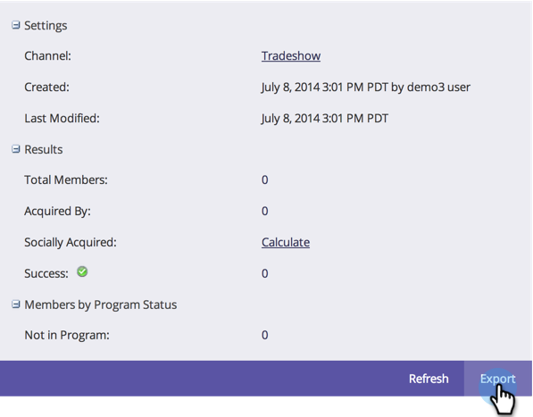

# Uso da guia Início do programa {#using-the-program-home-tab}

A guia inicial do programa fornece uma visão de alto nível do que está acontecendo em seu programa.

## Visualização de resumo {#summary-view}

1. Vá para **Marketing Activities**.

   

1. Selecione um programa.

   

   >[!NOTE]
   >
   >Essa é a exibição padrão. Ele fornece informações sobre suas Configurações, Programação, Resultados e Status do Programa dos Membros.

1. Clique em elementos sublinhados para fazer alterações ou exibir mais informações.

   

1. Clique em **Exportar** na parte inferior do Resumo para baixar o relatório.

   

## Usado pela Exibição {#used-by-view}

1. Em Atividades de marketing, selecione um programa.

   

1. Clique no menu suspenso **View**. Selecione **Usado por**.

   

   Esta exibição mostra quais campanhas inteligentes estão sendo usadas.

   

## Exibição de Associação {#membership-view}

1. Em Atividades de marketing, selecione um programa.

   

1. Clique no menu suspenso **View**. Selecione **Associação**.

   

   Isso mostra um gráfico de onde os membros estão à medida que se movem pelos status do programa.

   

   >[!NOTE]
   >
   >**** Historicamente, significa qualquer pessoa que já passou pelo programa, enquanto  **** atualmente inclui apenas pessoas que estão no programa.

   >[!MORELIKETHIS]
   >
   >[Compreensão da assinatura do programa](/help/marketo/product-docs/core-marketo-concepts/programs/creating-programs/understanding-program-membership.md)
