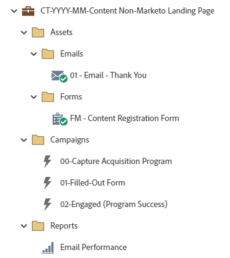

# CT-MM-AAAA-Conteúdo de página de destino não gerenciado pelo Marketo {#ct-yyyy-mm-content-non-marketo-landing-page}

Este é um exemplo de um programa de conteúdo com um formulário do Marketo Engage para baixar conteúdo em uma página de aterrissagem que não seja da Marketo Engage utilizando um programa padrão do Marketo Engage. Este programa deve funcionar com um formulário do Marketo Engage incorporado no seu site. O link para a oferta/conteúdo pode ser enviado em um email de agradecimento.

Para obter mais assistência estratégica ou ajuda para personalizar um programa, entre em contato com a Equipe de Conta da Adobe ou visite a página [Adobe Professional Services](https://business.adobe.com/br/customers/consulting-services/main.html){target="_blank"}.

## Resumo do canal {#channel-summary}

<table style="table-layout:auto">
 <tbody>
  <tr>
   <th>Canal</th>
   <th>Status da associação</th>
   <th>Comportamento das análises</th>
   <th>Tipo de programa</th>
  </tr>
  <tr>
   <td>Conteúdo da Web</td>
   <td>01-Membro
 02-Engajado-Sucesso</td>
   <td>Inclusivo</td>
   <td>Padrão</td>
  </tr>
 </tbody>
</table>

## O programa contém o seguinte Assets {#program-contains-the-following-assets}

<table style="table-layout:auto">
 <tbody>
  <tr>
   <th>Tipo</th>
   <th>Nome do modelo</th>
   <th>Nome do ativo</th>
  </tr>
  <tr>
   <td>Email</td>
   <td><a href="/help/marketo/product-docs/core-marketo-concepts/programs/program-library/quick-start-email-template.md" target="_blank">Modelo de email de início rápido</a></td>
   <td>01-Email-Obrigado</td>
  </tr>
  <tr>
   <td>Formulário</td>
   <td> </td>
   <td>Formulário de registro de conteúdo FM (ativo global no Design Studio)</td>
  </tr>
  <tr>
   <td>Relatório local</td>
   <td> </td>
   <td>Desempenho do e-mail</td>
  </tr>
  <tr>
   <td>Campanha inteligente</td>
   <td> </td>
   <td>00 - Programa de aquisição de captura</td>
  </tr>
  <tr>
   <td>Campanha inteligente</td>
   <td> </td>
   <td>01-Formulário Preenchido</td>
  </tr>
  <tr>
   <td>Campanha inteligente</td>
   <td> </td>
   <td>02-Envolvido (Sucesso do programa)</td>
  </tr>
  <tr>
   <td>Pasta</td>
   <td> </td>
   <td>Assets - hospeda todos os ativos criativos
 (subpastas para emails e Landing Pages)  </td>
  </tr>
  <tr>
   <td>Pasta</td>
   <td> </td>
   <td>Campanhas - hospeda todas as campanhas inteligentes</td>
  </tr>
  <tr>
   <td>Pasta</td>
   <td> </td>
   <td>Relatórios</td>
  </tr>
 </tbody>
</table>

## Meus tokens incluídos {#my-tokens-included}

<table style="table-layout:auto">
 <tbody>
  <tr>
   <th>Tipo de token</th>
   <th>Nome do token</th>
   <th>Valor</th>
  </tr>
  <tr>
   <td>Texto</td>
   <td><code>{{my.Content-Title}}</code></td>
   <td><code><--My Content Title Here--></code></td>
  </tr>
  <tr>
   <td>Texto</td>
   <td><code>{{my.Content-Type}}</code></td>
   <td><code><--My Content Type Here--></code></td>
  </tr>
  <tr>
   <td>Texto</td>
   <td><code>{{my.Content-URL}}</code></td>
   <td>my.ContentURL?without=http://</td>
  </tr>
  <tr>
   <td>Texto</td>
   <td><code>{{my.Email-FromAddress}}</code></td>
   <td>PlaceholderFrom.email@mydomain.com</td>
  </tr>
  <tr>
   <td>Texto</td>
   <td><code>{{my.Email-FromName}}</code></td>
   <td><code><--My From Name Here--></code></td>
  </tr>
  <tr>
   <td>Texto</td>
   <td><code>{{my.Email-ReplyToAddress}}</code></td>
   <td>reply-to.email@mydomain.com</td>
  </tr>
 </tbody>
</table>

## Regras de conflito {#conflict-rules}

* **Marcas do programa**
   * Criar marcas nesta assinatura - _Recomendado_
   * Ignorar

* **Modelo de página de aterrissagem com o mesmo nome**
   * Copiar modelo original
   * Usar modelo de destino - _Recomendado_

* **Imagens com o mesmo nome**
   * Manter ambos os arquivos
   * Substituir item nesta assinatura - _Recomendado_

* **Modelos de email com o mesmo nome**
   * Manter ambos os modelos
   * Substituir modelo existente - _Recomendado_

## Práticas recomendadas {#best-practices}

* Após a importação do programa de conteúdo, mova o formulário de um ativo local para um ativo global localizado no Design Studio.
   * Diminuir o número de formulários e utilizar mais ativos globais do Design Studio permite mais escalabilidade no design do programa e na governança administrativa. Ele também oferece flexibilidade para atualizações de conformidade regulares para campos, idioma de aceitação etc.

* Considere atualizar os modelos no programa importado para utilizar modelos com a marca atual ou atualize o modelo recém-importado para refletir a marca adicionando um trecho ou as informações apropriadas de logotipo/rodapé.

* Considere atualizar a convenção de nomenclatura deste exemplo de programa para alinhar-se à sua convenção de nomenclatura.

>[!NOTE]
>
>Lembre-se de atualizar os Valores do Meu token no modelo de programa e sempre que usar o programa, conforme necessário.

>[!TIP]
>
>Ative a campanha &quot;02-Envolvido&quot; para rastrear o sucesso antes que seu formulário seja publicado e os emails sejam enviados.
