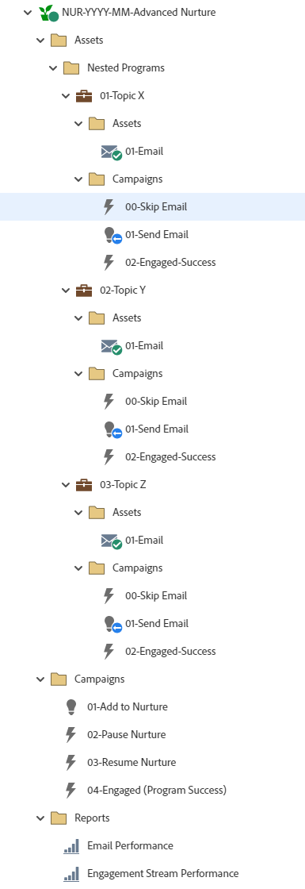

# NUR-AAAA-MM-Enfermagem Avançada {#nur-yyyy-mm-advanced-nurture}

Este é um exemplo de Programas de enfermagem avançados utilizando o Programa de engajamento do Marketo Engage. Os Programas de email aninhados impedem que as pessoas recebam conteúdo que já consumiram ou controlam o tipo de conteúdo que devem consumir em cada fluxo. O relatório de atribuição pode ser executado para cada Programa de email aninhado individual. Canais: o &quot;Nurture&quot; e um canal dedicado &quot;Nurture Email&quot; para os Programas de email aninhados enviam um email de informativo utilizando um Programa de email Marketo Engage. O email pode incluir ou não incluir um teste A/B.

Para obter mais assistência estratégica ou ajuda para personalizar um programa, entre em contato com a equipe de conta do Adobe ou visite o [Adobe Professional Services](https://business.adobe.com/customers/consulting-services/main.html){target="_blank"} página.

## Resumo do canal {#channel-summary}

<table style="table-layout:auto"> 
 <tbody> 
  <tr> 
   <th>Canal</th> 
   <th>Status da associação</th>
   <th>Comportamento das análises</th>
   <th>Tipo de programa</th>
  </tr> 
  <tr> 
   <td>Nutrição</td> 
   <td>01 - Membro 
 02 - Envolvido - Sucesso</td>
   <td>Inclusivo</td>
   <td>Envolvimento</td>
  </tr>
  <tr> 
   <td>E-mail de criação</td> 
   <td>01 - Ignorar 
 02 - Enviado
 03 - Envolvido - Sucesso</td>
   <td>Inclusivo</td>
   <td>Padrão</td>
  </tr>
 </tbody> 
</table>

## O programa contém os seguintes ativos {#program-contains-the-following-assets}

<table style="table-layout:auto"> 
 <tbody> 
  <tr> 
   <th>Tipo</th> 
   <th>Nome do modelo</th>
   <th>Nome do ativo</th>
  </tr> 
   <tr> 
   <td>Programa aninhado</td> 
   <td> </td>
   <td>01 - Tópico X</td>
  </tr>
  <tr> 
   <td>Programa aninhado</td> 
   <td> </td>
   <td>02 - Tópico Y</td>
  </tr>
  <tr> 
   <td>Programa aninhado</td> 
   <td> </td>
   <td>03 - Tópico Z</td>
  </tr>
  <tr> 
   <td>Email</td> 
   <td><a href="/help/marketo/product-docs/core-marketo-concepts/programs/program-library/quick-start-email-template.md" target="_blank">Modelo de e-mail de início rápido</a></td>
   <td>01 - Email (Ativo em programas aninhados)</td>
  </tr>
   <tr> 
   <td>Email</td> 
   <td><a href="/help/marketo/product-docs/core-marketo-concepts/programs/program-library/quick-start-email-template.md" target="_blank">Modelo de e-mail de início rápido</a></td>
   <td>02 - Email (Ativo em programas aninhados)</td>
  </tr>
   <tr> 
   <td>Email</td> 
   <td><a href="/help/marketo/product-docs/core-marketo-concepts/programs/program-library/quick-start-email-template.md" target="_blank">Modelo de e-mail de início rápido</a></td>
   <td>03 - Email (Ativo em programas aninhados)</td>
  </tr>
  <tr> 
   <td>Relatório local</td> 
   <td> </td>
   <td>Desempenho do e-mail</td>
  </tr>
  <tr> 
   <td>Relatório local</td> 
   <td> </td>
   <td>Desempenho do link do e-mail</td>
  </tr>
  <tr>
  <tr> 
   <td>Campanha inteligente</td> 
   <td> </td>
   <td>01 - Adicionar à criação</td>
  </tr>
  <tr> 
   <td>Campanha inteligente</td> 
   <td> </td>
   <td>02 - Pausar criação</td>
  </tr>
  <tr> 
   <td>Campanha inteligente</td> 
   <td> </td>
   <td>03 - Retomar Alimentação</td>
  </tr>
  <tr> 
   <td>Campanha inteligente</td> 
   <td> </td>
   <td>04 - Envolvido (Sucesso do programa)</td>
  </tr>
  <tr> 
   <td>Campanha inteligente</td> 
   <td> </td>
   <td>00 - Ignorar email (localizado em cada programa aninhado)</td>
  </tr>
  <tr> 
   <td>Campanha inteligente</td> 
   <td> </td>
   <td>01 - Enviar email (localizado em cada programa aninhado)</td>
  </tr>
  <tr> 
   <td>Campanha inteligente</td> 
   <td> </td>
   <td>02 - Engajado-Sucesso (Localizado em cada programa aninhado)</td>
  </tr>
  <tr> 
   <td>Pasta</td> 
   <td> </td>
   <td>Ativos (Contêm programas aninhados e as pastas de ativos também residem em programas aninhados para conter emails)</td>
  </tr>
  <tr> 
   <td>Pasta</td> 
   <td> </td>
   <td>Programas aninhados (atividades na pasta de ativos)</td>
  </tr>
  <tr> 
   <td>Pasta</td> 
   <td> </td>
   <td>Campanhas - Abriga todas as Campanhas inteligentes no programa de nutrição principal e as pastas de campanha também estão localizadas em cada Programa aninhado</td>
  </tr>
  <tr> 
   <td>Pasta</td> 
   <td> </td>
   <td>Relatórios</td>
  </tr>
 </tbody> 
</table>

## Meus tokens incluídos {#my-tokens-included}

<table style="table-layout:auto"> 
 <tbody> 
  <tr> 
   <th>Tipo de token</th> 
   <th>Nome do token</th>
   <th>Valor</th>
  </tr>
  <tr> 
   <td>Texto</td> 
   <td><code>{{my.Email-FromAddress}}</code></td>
   <td>PlaceholderFrom.email@mydomain.com</td>
  </tr>
  <tr> 
   <td>Texto</td> 
   <td><code>{{my.Email-FromName}}</code></td>
   <td><code><--My From Name Here--></code></td>
  </tr>
  <tr> 
   <td>Texto</td> 
   <td><code>{{my.Email-ReplyToAddress}}</code></td>
   <td>reply-to.email@mydomain.com</td>
  </tr>
 </tbody> 
</table>

## Regras de conflito {#conflict-rules}

* **Marcas de programa**
   * Criar tags nesta assinatura - _Recomendado_
   * Ignorar

* **Modelo de landing page com o mesmo nome**
   * Copiar modelo original
   * Usar modelo de destino - _Recomendado_

* **Imagens com o mesmo nome**
   * Manter ambos os arquivos
   * Substituir item desta inscrição - _Recomendado_

* **Modelos de e-mail com o mesmo nome**
   * Manter ambos os modelos
   * Substituir modelo existente - _Recomendado_

## Práticas recomendadas {#best-practices}

* Considere atualizar os modelos no programa importado para utilizar modelos com a marca atual ou atualize o modelo recém-importado para refletir a marca adicionando um trecho ou as informações apropriadas de logotipo/rodapé.

* Considere atualizar a convenção de nomenclatura deste exemplo de programa para alinhar-se à sua convenção de nomenclatura.

* Certifique-se de ter regras em vigor para pausar e retomar a cadência de criação. Essas Campanhas inteligentes devem ser ativadas ou programadas antes que o Programa de engajamento seja ativado.

>[!NOTE]
>
>Lembre-se de atualizar os Valores do Meu token no modelo de programa e sempre que usar o programa, conforme necessário.

>[!TIP]
>
>Não se esqueça de ativar a campanha &quot;04 - Envolvido (Sucesso do programa)&quot; para rastrear o sucesso! Faça isso _antes_ seus emails serão enviados.
