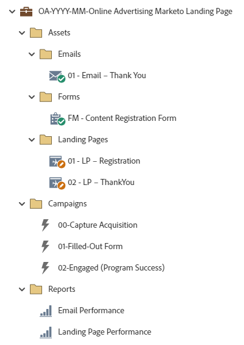

# Página de aterrissagem on-line do Advertising Marketo OA-YYYY-MM {#oa-yyyy-mm-online-advertising-marketo-landing-page}

Este é um exemplo de um programa de rastreamento de anúncios online, incluindo uma Página de aterrissagem do Marketo com formulário de registro e utilizando um Programa padrão do Marketo. O link para a oferta pode ser exibido na página de agradecimento, enviado em um email de agradecimento ou em ambos.

Para obter mais assistência estratégica ou ajuda para personalizar um programa, entre em contato com a Equipe de Conta da Adobe ou visite a página [Adobe Professional Services](https://business.adobe.com/customers/consulting-services/main.html){target="_blank"}.

## Resumo do canal {#channel-summary}

<table style="table-layout:auto">
 <tbody>
  <tr>
   <th>Canal</th>
   <th>Status da associação</th>
   <th>Comportamento das análises</th>
   <th>Tipo de programa</th>
  </tr>
  <tr>
   <td>Publicidade on-line</td>
   <td>01 - Membro
 02 - Envolvido - Êxito</td>
   <td>Inclusivo</td>
   <td>Padrão</td>
  </tr>
 </tbody>
</table>

## O programa contém o seguinte Assets {#program-contains-the-following-assets}

<table style="table-layout:auto">
 <tbody>
  <tr>
   <th>Tipo</th>
   <th>Nome do modelo</th>
   <th>Nome do ativo</th>
  </tr>
  <tr>
   <td>Formulário</td>
   <td> </td>
   <td>Registro de conteúdo FM</td>
  </tr>
  <tr>
   <td>Email</td>
   <td><a href="/help/marketo/product-docs/core-marketo-concepts/programs/program-library/quick-start-email-template.md" target="_blank">Modelo de e-mail de início rápido</a></td>
   <td>01-Email-Obrigado</td>
  </tr>
  <tr>
   <td>Página de destino</td>
   <td><a href="/help/marketo/product-docs/core-marketo-concepts/programs/program-library/quick-start-landing-page-template.md" target="_blank">Modelo de LP de Início Rápido</a></td>
   <td>01 - LP - Registro</td>
  </tr>
   <tr>
   <td>Página de destino</td>
   <td><a href="/help/marketo/product-docs/core-marketo-concepts/programs/program-library/quick-start-landing-page-template.md" target="_blank">Modelo de LP de Início Rápido</a></td>
   <td>02 - LP - Obrigado</td>
  </tr>
   <tr>
   <td>Relatório local</td>
   <td> </td>
   <td>Desempenho do e-mail</td>
  </tr>
  <tr>
   <td>Relatório local</td>
   <td> </td>
   <td>Desempenho da página</td>
  </tr>
  <tr>
   <td>Campanha inteligente</td>
   <td> </td>
   <td>00 - Programa de aquisição de captura</td>
  </tr>
  <tr>
   <td>Campanha inteligente</td>
   <td> </td>
   <td>01 - Formulário preenchido</td>
  </tr>
  <tr>
   <td>Campanha inteligente</td>
   <td> </td>
   <td>02 - Envolvido (Sucesso do programa)</td>
  </tr>
  <tr>
   <td>Pasta</td>
   <td> </td>
   <td>Assets - hospeda todos os ativos criativos
 (subpastas para emails e Landing Pages)  </td>
  </tr>
  <tr>
   <td>Pasta</td>
   <td> </td>
   <td>Campanhas - hospeda todas as campanhas inteligentes</td>
  </tr>
  <tr>
   <td>Pasta</td>
   <td> </td>
   <td>Relatórios</td>
  </tr>
 </tbody>
</table>

## Meus tokens incluídos {#my-tokens-included}

<table style="table-layout:auto">
 <tbody>
  <tr>
   <th>Tipo de token</th>
   <th>Nome do token</th>
   <th>Valor</th>
  </tr>
  <tr>
   <td>Texto formatado</td>
   <td><code>{{my.Content-Description}}</code></td>
   <td>Clique duas vezes para obter detalhes
 <code><--My Content Description Here--></code>
 Edite esta descrição de conteúdo no nível do programa, na guia Meus Tokens.
 Você aprenderá:
<li>Marcador 1</li>
<li>Marcador 2</li>
<li>Marcador 3</li></td>
  </tr>
  <tr>
   <td>Texto</td>
   <td><code>{{my.Content-Title}}</code></td>
   <td><code><--My Content Title Here--></code></td>
  </tr>
  <tr>
   <td>Texto</td>
   <td><code>{{my.Content-Type}}</code></td>
   <td><code><--My Content Type Here--></code></td>
  </tr>
  <tr>
   <td>Texto</td>
   <td><code>{{my.Content-URL}}</code></td>
   <td>my.ContentURL?without=http://</td>
  </tr>
  <tr>
   <td>Texto</td>
   <td><code>{{my.Email-FromAddress}}</code></td>
   <td>PlaceholderFrom.email@mydomain.com</td>
  </tr>
  <tr>
   <td>Texto</td>
   <td><code>{{my.Email-FromName}}</code></td>
   <td><code><--My From Name Here--></code></td>
  </tr>
  <tr>
   <td>Texto</td>
   <td><code>{{my.Email-ReplyToAddress}}</code></td>
   <td>reply-to.email@mydomain.com</td>
  </tr>
  <tr>
   <td>Texto</td>
   <td><code>{{my.PageURL-ThankYou}}</code></td>
   <td>My.ThankYouPageURL?sem o http://</td>
  </tr>
 </tbody>
</table>

IMAGEM DO PROGRAMA

## Regras de conflito {#conflict-rules}

* **Marcas do programa**
   * Criar marcas nesta assinatura - _Recomendado_
   * Ignorar

* **Modelo de página de aterrissagem com o mesmo nome**
   * Copiar modelo original
   * Usar modelo de destino - _Recomendado_

* **Imagens com o mesmo nome**
   * Manter ambos os arquivos
   * Substituir item nesta assinatura - _Recomendado_

* **Modelos de email com o mesmo nome**
   * Manter ambos os modelos
   * Substituir modelo existente - _Recomendado_

CAPTURA DE TELA DAS REGRAS DE CONFLITO

## Práticas recomendadas {#best-practices}

* Após a importação do programa de conteúdo, mova o formulário de um ativo local para um ativo global localizado no Design Studio.
   * Diminuir o número de formulários e utilizar mais ativos globais do Design Studio permite mais escalabilidade no design do programa e na governança administrativa. Ele também oferece flexibilidade em atualizações de conformidade regulares para campos, idioma de aceitação etc.

* Considere atualizar os modelos no programa importado para utilizar modelos com a marca atual ou atualize o modelo recém-importado para refletir a marca adicionando um trecho ou as informações apropriadas de logotipo/rodapé.

* Use as tags do programa para filtrar os relatórios de várias fontes do Advertising online.

* Considere atualizar a convenção de nomenclatura deste exemplo de programa para alinhar-se à sua convenção de nomenclatura.

>[!NOTE]
>
>Lembre-se de atualizar os Valores do Meu token no modelo de programa e sempre que usar o programa, conforme necessário.

>[!TIP]
>
>Não se esqueça de ativar a campanha &quot;02 - Envolvido (Sucesso do programa)&quot; para rastrear o sucesso! Faça _antes_ de o seu formulário estar online e os emails serem enviados.

>[!IMPORTANT]
>
>Meus tokens que referenciam um URL não podem conter o http:// ou https://, caso contrário, o link não funcionará adequadamente no ativo.
