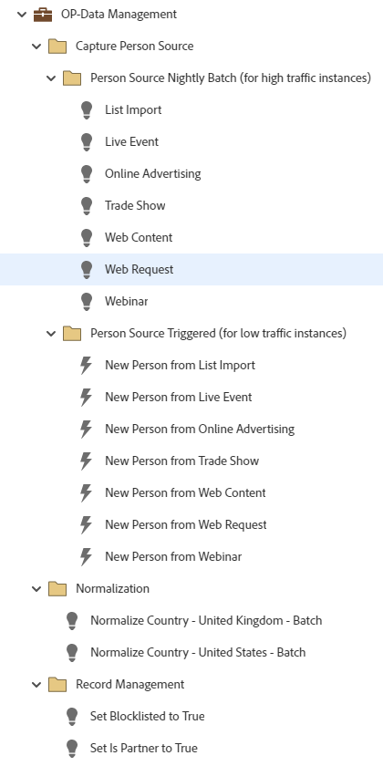

# OP-Gerenciamento de dados {#op-data-management}

Este é um exemplo de workflows de práticas recomendadas simples de gerenciamento de dados operacionais usando um Programa padrão, para ajudá-lo a gerenciar a consistência de dados para registros no banco de dados do Marketo Engage.

Para obter mais assistência estratégica ou ajuda para personalizar um programa, entre em contato com a Equipe de Conta da Adobe ou visite a página [Adobe Professional Services](https://business.adobe.com/customers/consulting-services/main.html){target="_blank"}.

## Resumo do canal {#channel-summary}

<table style="table-layout:auto">
 <tbody>
  <tr>
   <th>Canal</th>
   <th>Status da associação</th>
   <th>Comportamento das análises</th>
   <th>Tipo de programa</th>
  </tr>
  <tr>
   <td>Operacional</td>
   <td>01-Membro</td>
   <td>Operacional</td>
   <td>Padrão</td>
  </tr>
 </tbody>
</table>

## O programa contém o seguinte Assets {#program-contains-the-following-assets}

<table style="table-layout:auto">
 <tbody>
  <tr>
   <th>Tipo</th>
   <th>Nome do modelo</th>
   <th>Nome do ativo</th>
  </tr>
  <tr>
   <td>Campanha inteligente</td>
   <td> </td>
   <td>Normalizar país - Estados Unidos</td>
  </tr>
  <tr>
   <td>Campanha inteligente</td>
   <td> </td>
   <td>Normalizar país - Reino Unido</td>
  </tr>
  <tr>
   <td>Campanha inteligente</td>
   <td> </td>
   <td>Definir ➡ como verdadeiro</td>
  </tr>
  <tr>
   <td>Campanha inteligente</td>
   <td> </td>
   <td>Definir é parceiro como verdadeiro</td>
  </tr>
  <tr>
   <td>Campanha inteligente</td>
   <td> </td>
   <td>Importação de lista</td>
  </tr>
  <tr>
   <td>Campanha inteligente</td>
   <td> </td>
   <td>Evento ao vivo</td>
  </tr>
  <tr>
   <td>Campanha inteligente</td>
   <td> </td>
   <td>Publicidade on-line</td>
  </tr>
  <tr>
   <td>Campanha inteligente</td>
   <td> </td>
   <td>Exposição</td>
  </tr>
  <tr>
   <td>Campanha inteligente</td>
   <td> </td>
   <td>Conteúdo da Web</td>
  </tr>
  <tr>
   <td>Campanha inteligente</td>
   <td> </td>
   <td>Solicitação da Web</td>
  </tr>
  <tr>
   <td>Campanha inteligente</td>
   <td> </td>
   <td>Webinário</td>
  </tr>
  <tr>
   <td>Campanha inteligente</td>
   <td> </td>
   <td>Nova pessoa da importação da lista</td>
  </tr>
  <tr>
   <td>Campanha inteligente</td>
   <td> </td>
   <td>Nova pessoa do evento ao vivo</td>
  </tr>
  <tr>
   <td>Campanha inteligente</td>
   <td> </td>
   <td>Nova pessoa do Advertising online</td>
  </tr>
  <tr>
   <td>Campanha inteligente</td>
   <td> </td>
   <td>Nova pessoa da feira de negócios</td>
  </tr>
   <tr>
   <td>Campanha inteligente</td>
   <td> </td>
   <td>Nova pessoa do conteúdo da Web</td>
  </tr>
   <tr>
   <td>Campanha inteligente</td>
   <td> </td>
   <td>Nova pessoa da solicitação da Web</td>
  </tr>
   <tr>
   <td>Campanha inteligente</td>
   <td> </td>
   <td>Nova pessoa do webinário</td>
  </tr>
  <tr>
   <td>Pasta</td>
   <td> </td>
   <td>Lote noturno do Source da pessoa (para instâncias de alto tráfego)</td>
  </tr>
  <tr>
   <td>Pasta</td>
   <td> </td>
   <td>Source de pessoa acionado (para instâncias de tráfego baixo)</td>
  </tr>
  <tr>
   <td>Pasta</td>
   <td> </td>
   <td>Capturar Source de pessoa</td>
  </tr>
  <tr>
   <td>Pasta</td>
   <td> </td>
   <td>Normalização</td>
  </tr>
  <tr>
   <td>Pasta</td>
   <td> </td>
   <td>Gerenciamento de registros</td>
  </tr>
  <tr>
   <td>Pasta</td>
   <td> </td>
   <td>Lista de bloqueios</td>
  </tr>
 </tbody>
</table>

## Regras de conflito {#conflict-rules}

* **Marcas do programa**
   * Criar marcas nesta assinatura - _Recomendado_
   * Ignorar

* **Modelo de página de aterrissagem com o mesmo nome**
   * Copiar modelo original - _Recomendado_
   * Usar modelo de destino

* **Imagens com o mesmo nome**
   * Manter ambos os arquivos - _Recomendado_
   * Substituir item desta inscrição

* **Modelos de email com o mesmo nome**
   * Manter ambos os modelos - _Recomendado_
   * Substituir modelo existente

## Práticas recomendadas {#best-practices}

* Cada campanha criada deve ser um exemplo na criação de práticas recomendadas e não específica para seus casos de uso. Lembre-se de atualizar as Campanhas inteligentes para lidar com seus pontos problemáticos específicos e desafios de dados.

* Considere atualizar a convenção de nomenclatura deste exemplo de programa para alinhar-se à sua convenção de nomenclatura.
