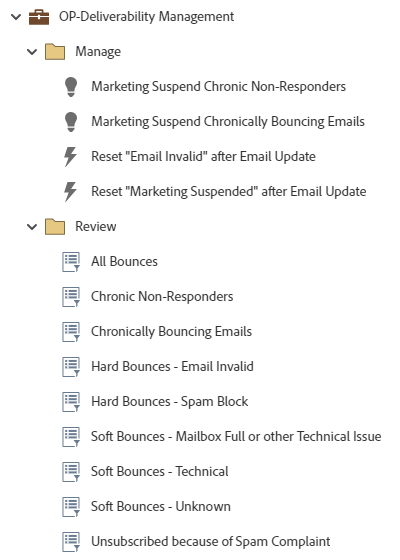

# Gerenciamento de Entregabilidade OP {#op-deliverability-management}

Este é um exemplo de workflows de práticas recomendadas de gerenciamento de entrega que utilizam um Programa padrão Marketo Engage, para analisar seu estado atual de capacidade de entrega de email e gerenciar rejeições crônicas e usuários que não respondem.

>[!NOTE]
>
>Exige que o campo de sequência personalizado &quot;Motivo da suspensão de marketing&quot; seja importado. [Saiba mais](https://nation.marketo.com/community/product_and_support/support_solutions/blog/2016/04/18/how-to-monitor-deliverability-using-marketo){target="_blank"}.

Para obter mais assistência estratégica ou ajuda para personalizar um programa, entre em contato com a equipe de conta do Adobe ou visite o [Adobe Professional Services](https://business.adobe.com/customers/consulting-services/main.html){target="_blank"} página.

## Resumo do canal {#channel-summary}

<table style="table-layout:auto"> 
 <tbody> 
  <tr> 
   <th>Canal</th> 
   <th>Status da associação</th>
   <th>Comportamento das análises</th>
   <th>Tipo de programa</th>
  </tr> 
  <tr> 
   <td>Operacional</td> 
   <td>01-Membro</td>
   <td>Operacional</td>
   <td>Padrão</td>
  </tr>
 </tbody> 
</table>

## Campos de pré-requisito {#prerequisite-fields}

<table style="table-layout:auto"> 
 <tbody> 
  <tr> 
   <th>Tipo</th> 
   <th>Nome intuitivo</th>
   <th>Nome da API</th>
  </tr>
  <tr> 
   <td>Sequência de caracteres</td> 
   <td>Motivo da suspensão de marketing</td>
   <td>MarketingSuspendedReason</td>
  </tr>
 </tbody> 
</table>

## O programa contém os seguintes ativos {#program-contains-the-following-assets}

<table style="table-layout:auto"> 
 <tbody> 
  <tr> 
   <th>Tipo</th> 
   <th>Nome do modelo</th>
   <th>Nome do ativo</th>
  </tr>
  <tr> 
   <td>Campanha inteligente</td> 
   <td> </td>
   <td>Não-respondedores crônicos de suspensão de marketing</td>
  </tr>
  <tr> 
   <td>Campanha inteligente</td> 
   <td> </td>
   <td>Suspensão de marketing: emails com rejeição crônica</td>
  </tr>
  <tr> 
   <td>Campanha inteligente</td> 
   <td> </td>
   <td>Redefinir "Email inválido" após a atualização de email</td>
  </tr>
  <tr> 
   <td>Campanha inteligente</td> 
   <td> </td>
   <td>Redefinir "Marketing suspenso" após a atualização de email</td>
  </tr>
  <tr> 
   <td>Pasta</td> 
   <td> </td>
   <td>Gerenciar</td>
  </tr>
  <tr> 
   <td>Pasta</td> 
   <td> </td>
   <td>Revisar</td>
  </tr>
 </tbody> 
</table>

## Regras de conflito {#conflict-rules}

* **Marcas de programa**
   * Criar tags nesta assinatura - _Recomendado_
   * Ignorar

* **Modelo de landing page com o mesmo nome**
   * Copiar modelo original - _Recomendado_
   * Usar modelo de destino

* **Imagens com o mesmo nome**
   * Manter ambos os arquivos - _Recomendado_
   * Substituir item desta inscrição

* **Modelos de e-mail com o mesmo nome**
   * Manter ambos os modelos - _Recomendado_
   * Substituir modelo existente

## Práticas recomendadas {#best-practices}

* Cada campanha criada deve ser um exemplo na criação de práticas recomendadas e não específica para seus casos de uso. Lembre-se de atualizar as Campanhas inteligentes para lidar com seus pontos problemáticos específicos e desafios de dados.

* Considere atualizar a convenção de nomenclatura deste exemplo de programa para alinhar-se à sua convenção de nomenclatura.
