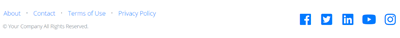

# Modelo de página de destino de início rápido {#quick-start-landing-page-template}

Alguns dos programas iniciais na Biblioteca de referência da Marketo Engage contêm um modelo de página de aterrissagem simples, fácil de usar e personalizável que permite a criação rápida de páginas de aterrissagem em vários casos de uso de marketing.

>[!TIP]
>
>Saiba mais sobre [Modelos de página de aterrissagem guiados](/help/marketo/product-docs/demand-generation/landing-pages/landing-page-templates/create-a-guided-landing-page-template.md){target="_blank"}

Para obter mais assistência estratégica ou ajuda para personalizar um programa, entre em contato com a Equipe de Conta da Adobe ou visite a página [Adobe Professional Services](https://business.adobe.com/customers/consulting-services/main.html){target="_blank"}.

## Resumo de seções {#sections-summary}

### Seção Logotipo {#logo-section}

* Inclui um elemento de imagem para trocar o logotipo por outra imagem
* Inclui variáveis a serem editadas:
   * Tamanho do logotipo
   * Alinhamento do logotipo
   * Cor de fundo da seção de logotipo
   * Mostrar ou ocultar a seção
   * Preenchimento superior da seção
   * Preenchimento inferior da seção
* 

### Seção Imagem {#image-section}

* Inclui um elemento de imagem para trocar o logotipo por outra imagem
* Inclui variáveis a serem editadas:
   * O link da imagem do banner
   * A largura do banner - um dos switches na parte inferior direita permite que você transforme a imagem na largura do container de conteúdo ou na largura do navegador inteiro
   * Mostrar ou ocultar a seção
* 

### Texto de 2 colunas à esquerda, Seção Formulário à direita {#two-col-left-form-right}

* Elemento de texto do título para atualizar a cópia do título
* Elemento de texto de parágrafo para atualizar a cópia de parágrafo
* Elemento de formulário a ser adicionado em um formulário
* Elemento de texto abaixo do formulário para editar o texto e os links da política de privacidade
* Variáveis a editar:
Cor do plano de fundo da seção
   * Cor do plano de fundo diretamente atrás do formulário
   * Raio da borda da caixa ao redor do formulário (tornando-a com cantos curvos ou, se definida como &quot;0&quot;, quadrada fora dos cantos)
   * Mostrar ou ocultar a seção inteira
   * Mostrar ou ocultar apenas o formulário (ocultar o formulário faz com que o texto na coluna à esquerda preencha a largura da página. Isso pode ser usado para uma página de agradecimento ou confirmação em que um formulário não está presente.)
   * Mostrar ou ocultar o texto da política de privacidade
* 

### Seção de vídeo {#video-section}

* Elemento de texto para atualizar o texto do título
* Variáveis a editar:
   * Cor do plano de fundo da seção
   * Código de inserção de vídeo
   * Mostrar/ocultar título do vídeo
   * Mostrar/ocultar vídeo
* 

### Seção de Rodapé {#footer-section}

* Elemento de texto para editar o conteúdo na coluna à esquerda
* Elemento de texto para atualizar os ícones sociais (os ícones estão usando a fonte FontAwesome em vez de imagens, mas podem ser substituídos por imagens).
* Variáveis a editar:
   * Cor do plano de fundo da seção
   * Cor dos ícones sociais
   * Mostrar/ocultar seção
* 

### Variáveis adicionais {#additional-variables}

* **Raio da borda do botão**: ajusta o botão de formulário para ser arredondado ou retangular
* **Cor do botão**: atualiza a cor do botão no formulário
* **Cor de foco do botão**: altera a cor do estado de foco do botão no formulário
* **Cor do link**: atualiza a cor dos links na página
* **Espaçamento Superior da Seção**: adiciona espaço acima de cada seção, exceto a seção do logotipo
* **Espaçamento inferior da seção**: adiciona espaço abaixo de cada seção, exceto a seção de logotipos
