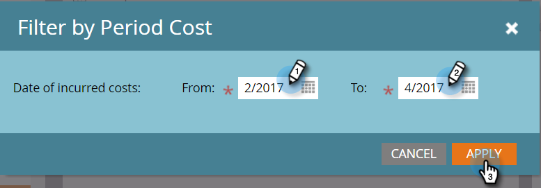

# Filtrar um Relatório de Programa por Custo do Período {#filter-a-program-report-by-period-cost}

Concentre seus [relatório de desempenho do programa](/help/marketo/product-docs/core-marketo-concepts/programs/program-performance-report/create-a-program-performance-report.md){target="_blank"} em um período de tempo de custo específico.

1. Ir para **[!UICONTROL Atividades de marketing]** (ou **[!UICONTROL Analytics]**).

   

1. Selecione o relatório de desempenho do programa.

   

1. Clique em **[!UICONTROL Configuração]** guia e arraste sobre **[!UICONTROL Custo do Período]**.

   

1. Insira o **[!UICONTROL De]** e **[!UICONTROL Para]** datas para custos incorridos e clique em **[!UICONTROL Aplicar]**.

   

1. Pronto! Clique em **[!UICONTROL Relatório]** para ver apenas os programas que estão dentro do período especificado de tempo de custo.

   

>[!NOTE]
>
>[Filtrar um relatório de programa por programa](/help/marketo/product-docs/core-marketo-concepts/programs/program-performance-report/filter-a-program-report-by-program.md){target="_blank"}
