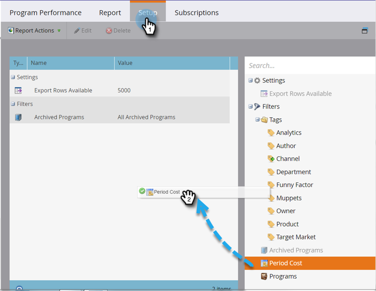

# Filtrar um relatório de programa por custo do período {#filter-a-program-report-by-period-cost}

Concentre seu [relatório de desempenho do programa](/help/marketo/product-docs/core-marketo-concepts/programs/program-performance-report/create-a-program-performance-report.md){target="_blank"} em um período de tempo de custo específico.

1. Vá para **[!UICONTROL Atividades de marketing]** (ou **[!UICONTROL Analytics]**).

   

1. Selecione o relatório de desempenho do programa.

   

1. Clique na guia **[!UICONTROL Instalação]** e arraste pelo **[!UICONTROL Custo do Período]**.

   

1. Insira as datas **[!UICONTROL De]** e **[!UICONTROL Até]** para custos incorridos e clique em **[!UICONTROL Aplicar]**.

   

1. Pronto! Clique na guia **[!UICONTROL Relatório]** para ver apenas os programas que estão dentro do período de tempo de custo especificado.

   

>[!NOTE]
>
>[Filtrar um Relatório de Programa por Programa](/help/marketo/product-docs/core-marketo-concepts/programs/program-performance-report/filter-a-program-report-by-program.md){target="_blank"}
