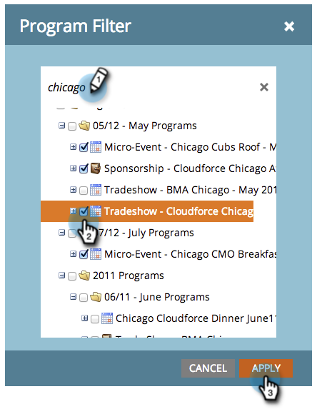

# Filtrar um relatório de programa por programa {#filter-a-program-report-by-program}

Concentre seu [relatório de desempenho do programa](/help/marketo/product-docs/core-marketo-concepts/programs/program-performance-report/create-a-program-performance-report.md){target="_blank"} em programas específicos para comparar seu desempenho.

1. Vá para **[!UICONTROL Atividades de marketing]** (ou **[!UICONTROL Analytics]**).

   

1. Selecione o relatório de desempenho do programa.

   

1. Clique na guia **[!UICONTROL Instalação]** e arraste por **[!UICONTROL Programas]**.

   

1. Escolha as pastas e os programas específicos a serem incluídos no relatório.

   

   >[!TIP]
   >
   >Se você selecionar uma pasta, seu relatório incluirá tudo o que a pasta contém no momento em que o relatório é executado.

1. Isso é tudo! Clique na guia **[!UICONTROL Relatório]** para ver _apenas_ os programas selecionados em seu relatório.

   

>[!NOTE]
>
>[Filtrar um Relatório de Programa por Marca](/help/marketo/product-docs/core-marketo-concepts/programs/program-performance-report/filter-a-program-report-by-tag.md){target="_blank"}
