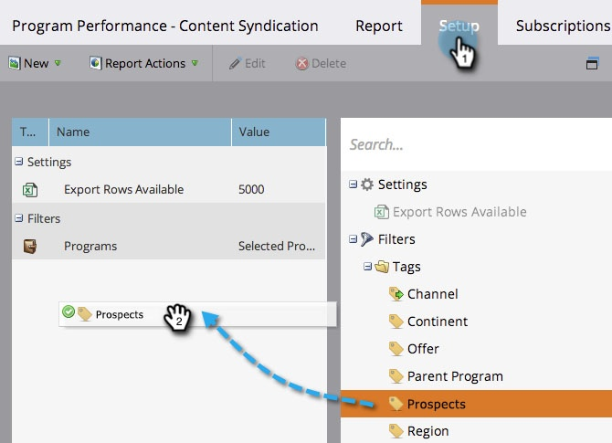
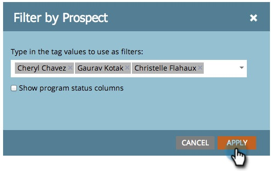

# Filtrar um relatório de programa por tag {#filter-a-program-report-by-tag}

Concentre seu [relatório de desempenho do programa](/help/marketo/product-docs/core-marketo-concepts/programs/program-performance-report/create-a-program-performance-report.md) em [marcas](/help/marketo/product-docs/core-marketo-concepts/programs/working-with-programs/understanding-tags.md){target="_blank"} específicas.

1. Vá para **[!UICONTROL Atividades de marketing]** (ou **[!UICONTROL Analytics]**).

   

1. Selecione seu relatório de **[!UICONTROL Desempenho do Programa]**.

   

1. Clique na guia **[!UICONTROL Configuração]** e arraste um dos filtros **[!UICONTROL Marcas]**.

   

1. Escolha os valores de tag a serem incluídos no relatório.

   

1. Clique em **[!UICONTROL Aplicar]**.

   

1. Pronto! Clique na guia **[!UICONTROL Relatório]** para ver _apenas_ os programas que correspondem às marcas selecionadas em seu relatório.

   

>[!NOTE]
>
>[Filtrar um Relatório de Programa por Custo do Período](/help/marketo/product-docs/core-marketo-concepts/programs/program-performance-report/filter-a-program-report-by-period-cost.md){target="_blank"}
