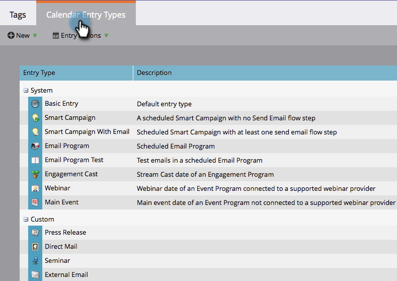
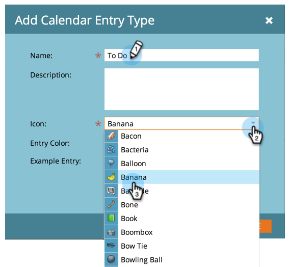

# Criar tipos de entrada personalizados {#create-custom-entry-types}

Você pode criar tipos de entrada personalizados para usar na Exibição de programação do programa. Isso permitirá que você acompanhe todos os itens de programação que não sejam da Marketo e que afetem seu programa.

1. Vá para a seção **[!UICONTROL Administrador]** e clique em **[!UICONTROL Marcas]**.

   

1. Clique em **[!UICONTROL Tipo de Entrada de Calendário]**.

   

1. Clique no menu suspenso **[!UICONTROL Novo]** e selecione **[!UICONTROL Tipo de entrada]**.

   

1. Nomeie sua entrada e selecione um ícone.

   

1. Selecione uma **[!UICONTROL Cor de entrada]**.

   

1. Clique em **[!UICONTROL Salvar]**.

   

Agora, quando você criar uma nova entrada na sua área de agendamento, este tipo será uma opção.

>[!NOTE]
>
>Você pode criar até 100 tipos de entradas personalizadas.
