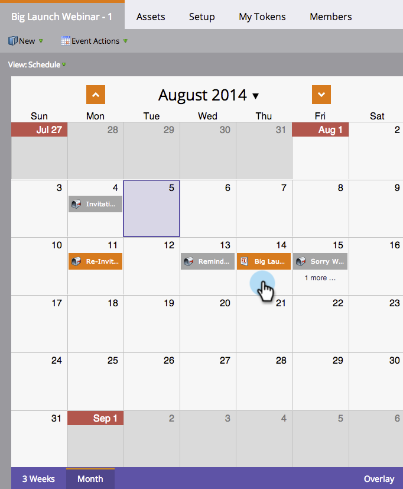
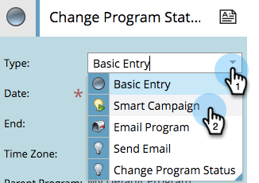
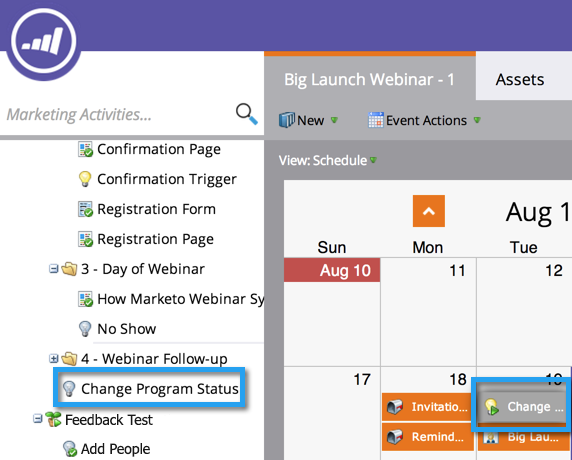

# Criação de uma campanha inteligente em lote na visualização do cronograma do programa {#creating-a-batch-smart-campaign-in-the-program-schedule-view}

Você pode criar novas Campanhas inteligentes e [executar novamente as existentes](/help/marketo/product-docs/core-marketo-concepts/programs/program-schedule-view/rerun-a-smart-campaign-in-the-program-schedule-view.md){target="_blank"} dentro do seu programa a partir da exibição do cronograma do programa.

>[!NOTE]
>
>Somente campanhas em lote podem ser criadas nesta visualização. Campanhas de acionador não são suportadas.

1. Selecione a data em que gostaria que sua nova Campanha inteligente fosse executada.

   

1. Escolha um nome para a entrada, que se tornará a nova Campanha inteligente. Pressione a tecla **[!UICONTROL Enter/Return]** para confirmar o nome.

   

1. Clique no menu suspenso **[!UICONTROL Tipo]** e escolha **[!UICONTROL Campanha inteligente]**.

   

   >[!NOTE]
   >
   >Você também pode executar uma Campanha inteligente existente selecionando-a no menu suspenso.

   

1. Escolha suas regras da [Campanha inteligente](/help/marketo/product-docs/core-marketo-concepts/smart-campaigns/creating-a-smart-campaign/create-a-new-smart-campaign.md){target="_blank"}.

   

1. Agora você verá essa Campanha inteligente como confirmada na visualização de programação e nos detalhes da entrada.

   

Isso criará uma nova Campanha inteligente executada em seu programa.
