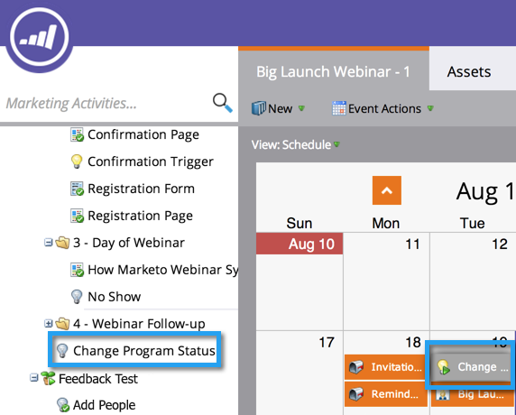

# Criando uma Campanha inteligente em lote na Visualização do Cronograma do programa {#creating-a-batch-smart-campaign-in-the-program-schedule-view}

Você pode criar novas campanhas inteligentes e [executar novamente as existentes](/help/marketo/product-docs/core-marketo-concepts/programs/program-schedule-view/rerun-a-smart-campaign-in-the-program-schedule-view.md) dentro do seu programa a partir da visualização do cronograma do programa.

>[!NOTE]
>
>Somente campanhas inteligentes em lote podem ser criadas nesta visualização. Campanhas de acionador não são suportadas.

1. Selecione a data em que deseja que a nova campanha inteligente seja executada.

   

1. Escolha um nome para sua entrada, que se tornará sua nova campanha inteligente. Pressione a tecla **Enter/Return** para confirmar o nome.

   

1. Clique na lista suspensa **Tipo** e escolha **Campanha inteligente**.

   

   >[!NOTE]
   >
   >Você também pode executar uma campanha inteligente existente selecionando-a no menu suspenso.

   

1. Escolha suas regras de [campanha inteligente](/help/marketo/product-docs/core-marketo-concepts/smart-campaigns/creating-a-smart-campaign/create-a-new-smart-campaign.md).

   

1. Agora você verá essa campanha inteligente como confirmada na visualização agendada e nos detalhes de entrada.

   

Isso criará uma nova campanha inteligente executada em seu programa.
