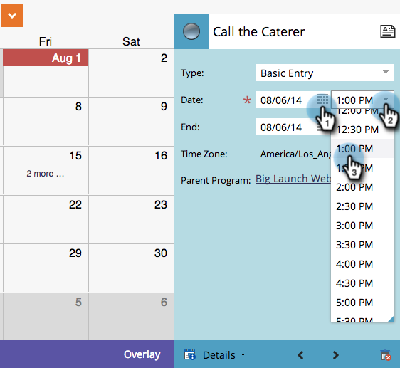

# Criação de uma entrada na visualização Cronograma do programa {#creating-an-entry-in-the-program-schedule-view}

Você pode criar entradas na exibição de programação do programa para complementar um programa existente.

## Criar uma entrada básica {#create-a-basic-entry}

1. Vá para **[!UICONTROL Atividades de marketing]**.

   

1. Selecione seu programa. Clique no menu suspenso **[!UICONTROL Exibir]**. Selecione **[!UICONTROL Agendar]**.

   

1. Clique em um dia ao qual adicionar a entrada.

   

1. Nomeie a entrada. Pressione **[!UICONTROL Enter]** para confirmar o nome.

   

1. Selecione a data/hora inicial e final da nova entrada.

   

1. Clique no ícone de descrição para adicionar mais informações.

   

1. Insira sua descrição e clique em **[!UICONTROL Salvar]**.

   

1. Passe o mouse sobre o ícone de descrição para exibir a descrição da entrada.

   

## Alterar Tipo de Entrada {#change-entry-type}

1. Selecione uma entrada básica na exibição **[!UICONTROL Agenda]**.

   

1. Selecione o menu suspenso **[!UICONTROL Type]**. Escolha um novo tipo de entrada.

   >[!NOTE]
   >
   >A tarefa é uma [entrada personalizada](/help/marketo/product-docs/core-marketo-concepts/programs/program-schedule-view/create-custom-entry-types.md){target="_blank"}. Você pode criar uma tarefa pendente e outras entradas personalizadas para ajudar a monitorar itens que não sejam da agenda do Marketo.

   

   Legal! Você deve ver as alterações imediatamente.

   

>[!NOTE]
>
> Você também pode criar uma [campanha inteligente](/help/marketo/product-docs/core-marketo-concepts/programs/program-schedule-view/creating-a-batch-smart-campaign-in-the-program-schedule-view.md){target="_blank"} ou um [programa de email](/help/marketo/product-docs/core-marketo-concepts/programs/program-schedule-view/creating-a-new-email-program-in-the-schedule-view.md){target="_blank"} a partir da exibição de agendamento.
