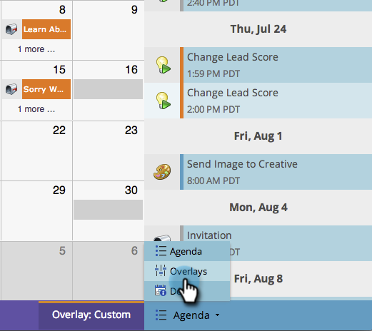

# Criação de sobreposições personalizadas na visualização Cronograma do programa {#creating-custom-overlays-in-program-schedule-view}

É possível criar sobreposições personalizadas para exibir entradas relevantes às suas necessidades.

1. Clique no menu suspenso **[!UICONTROL Agenda]**.

   

1. Selecione **[!UICONTROL Sobreposições]**.

   

1. Selecione os [!UICONTROL Tipos de entrada] que você gostaria que ficassem visíveis na sobreposição.

   

1. Você também pode filtrar por [marcas de programa](/help/marketo/product-docs/core-marketo-concepts/programs/working-with-programs/use-tags-in-a-program.md){target="_blank"}.

   

   Fantástico. Agora, a sobreposição exibirá apenas as entradas definidas.

   
