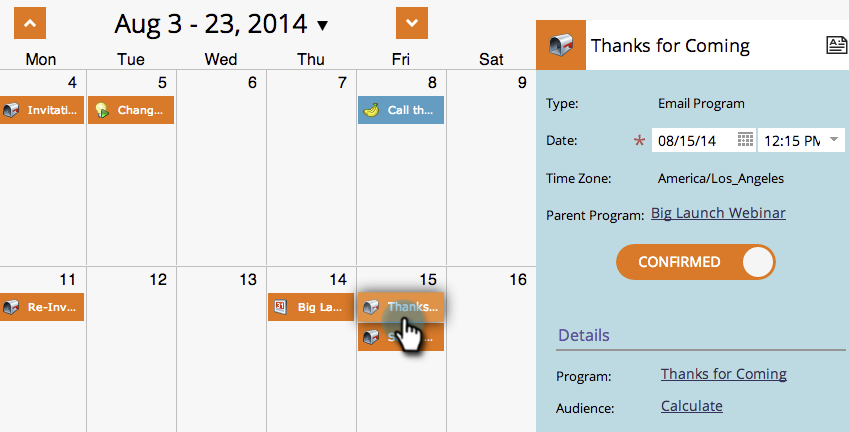

# Editar entradas na visualização Cronograma do programa {#editing-entries-in-the-program-schedule-view}

Você pode fazer edições nos diferentes elementos do seu programa na visualização de cronograma.

## Editar o nome de uma entrada {#edit-an-entrys-name}

1. Selecione a entrada que deseja editar.

   

1. Digite um novo nome e pressione **[!UICONTROL Enter/Return]** no teclado para confirmar a alteração.

   

>[!CAUTION]
>
>Isso só altera o nome de exibição na exibição de agendamento. O nome do ativo no programa permanecerá o mesmo.

## Editar a descrição de uma entrada {#edit-an-entrys-description}

1. Clique no ícone de descrição.

   

1. Edite sua descrição. Clique em **[!UICONTROL Salvar]**.

   

1. A descrição foi atualizada.

   

## Editar a data de uma entrada {#edit-an-entrys-date}

1. Selecione a nova data.

   

A data da sua entrada foi atualizada.

>[!NOTE]
>
> As entradas de programa de email e Campanha inteligente que já foram executadas não podem ser movidas para o passado.
