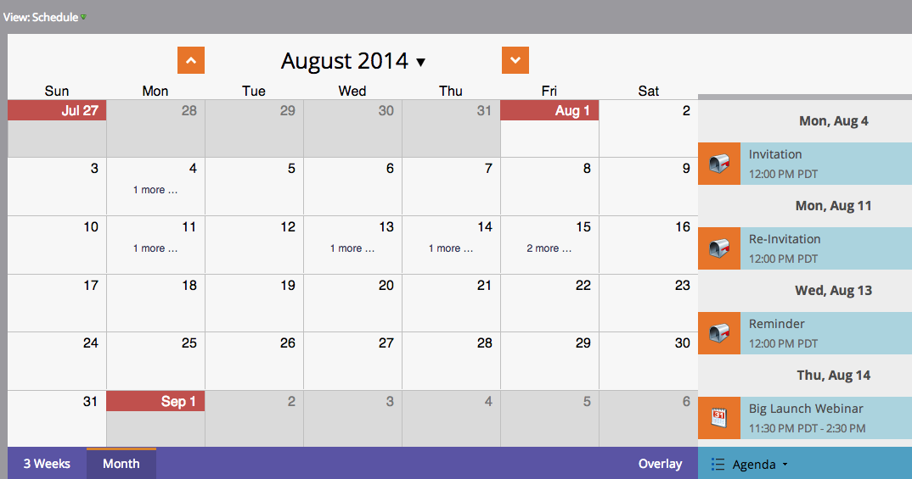

# Navegando na Exibição de Programação do Programa {#navigating-the-program-schedule-view}

Estas são as noções básicas para ajudá-lo a navegar na exibição de programação do programa.

## Localizar a Exibição de Agendamento {#find-the-schedule-view}

1. Vá para **[!UICONTROL Atividades de marketing]**.

   

1. Selecione seu programa. Clique no menu suspenso **[!UICONTROL Exibir]**. Selecione **[!UICONTROL Agendar]**.

   

   Agora você verá a exibição do cronograma do seu programa.

   

>[!NOTE]
>
>A visualização do cronograma do programa é fixa. Depois de definido, todos os programas assumirão a exibição de cronograma como padrão.

## Alternar entre entradas {#switching-between-entries}

1. Nos detalhes da entrada, clique nas setas para ir até a próxima entrada programada.

   

   Muito legal, não é?

   

## Exibir Menu de Contexto {#view-context-menu}

1. Clique com o botão direito do mouse em qualquer programa para fazer edições no Programa, Smart List, Configuração, Meus tokens ou Membros.

   

## Alteração entre modos {#changing-between-modes}

1. Clicar em **[!UICONTROL 3 Semanas]** ou **[!UICONTROL Mês]** alterará as datas visíveis na exibição.

   

## Modo de Exibição de Tela Inteira {#full-screen-view}

1. Você pode clicar no ícone de tela no canto superior direito para exibir o cronograma do programa no modo de tela cheia.

   

Ótimo! Agora que você sabe como visualizar seu programa, vamos aprender as outras coisas interessantes que ele pode fazer.

>[!MORELIKETHIS]
>
>[Criando uma Entrada na Exibição da Agenda de Programas](/help/marketo/product-docs/core-marketo-concepts/programs/program-schedule-view/creating-an-entry-in-the-program-schedule-view.md){target="_blank"}
