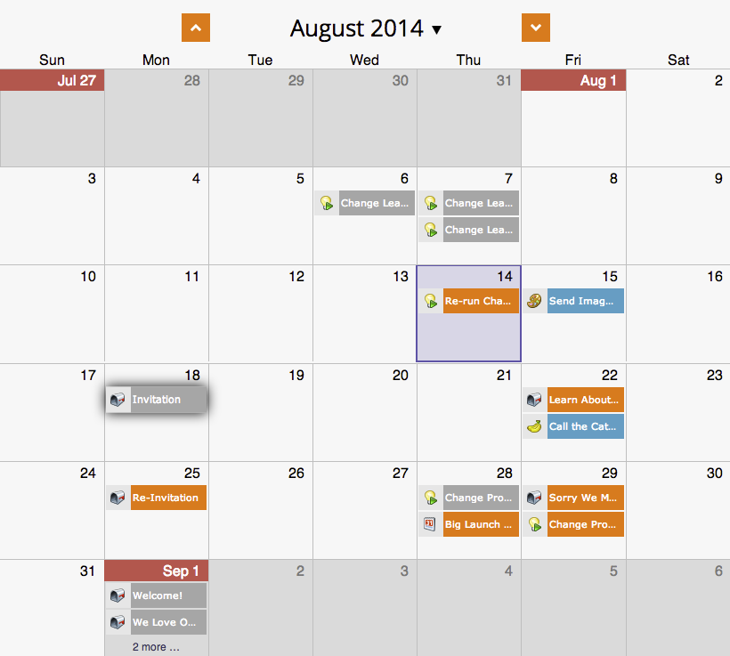

# Reprogramando um Programa inteiro da Visualização Agendar {#rescheduling-an-entire-program-from-the-schedule-view}

Ao clonar um programa ou evento com datas, provavelmente você desejará reprogramar todas as datas de uma vez. Veja como.

1. Selecione o programa que deseja reprogramar.

   

1. Selecione o menu suspenso Ação do Evento. Escolha **Reprogramar entradas**.

   

1. Selecione uma entrada de âncora. Com base nessa mudança, todas as outras entradas se moverão junto com ela.

   

1. Escolha a nova data de start.

   

1. Clique em **Reprogramar**.

   

1. Nossos recuperadores de dados então cancelarão a aprovação, reprogramarão e reaprovarão todos os seus ativos com as datas corretas!

   

>[!NOTE]
>
>Os ativos que já foram executados não serão movidos.

Agora tudo está reprogramado. Ajuste quaisquer datas específicas, conforme necessário.

