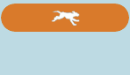

# Noções básicas sobre datas provisórias e confirmadas {#understanding-tentative-confirmed-dates}

Campanhas inteligentes e programas de email têm um recurso poderoso para serem marcados como **[!UICONTROL Provisórios]** ou **[!UICONTROL Confirmados]**. É assim que funcionam.

## Tentativa {#tentative}

Datas não confirmadas transmitem a intenção. Pense nisso como _desenhando_ algo no calendário. As entradas provisórias não serão executadas - elas são somente marcadores de posição.

>[!NOTE]
>
>Somente campanhas inteligentes em lote e programas de email podem ser experimentais.

## Confirmando Entradas {#confirming-entries}

É como aprovar um ativo, portanto, as entradas precisam ser totalmente configuradas antes de você poder confirmá-las. Depois que todos os patos estiverem seguidos, você poderá confirmar as entradas deslizando a guia [!UICONTROL Tentativa] para a direita.

>[!NOTE]
>
>Por que o cachorro? Ele é um recuperador. Ele está buscando seus dados.

## confirmada {#confirmed}

As entradas confirmadas serão definitivamente executadas. Eles têm regras, ativos aprovados e uma data e hora confirmadas.

## Concluído  {#finished}

As entradas concluídas já foram executadas. Eles só podem estar no passado (obviamente). Depois que uma entrada é executada e está **[!UICONTROL Concluída]**, não é possível movê-la ou torná-la provisória. (Sem alterar a realidade e interromper o fluxo contínuo de tempo.)

Esses estados são ferramentas poderosas. Ao clonar um programa, todas as datas da campanha inteligente e do programa de email serão provisórias. Elas podem ser confirmadas diretamente na exibição de agendamento. Legal, não é?
