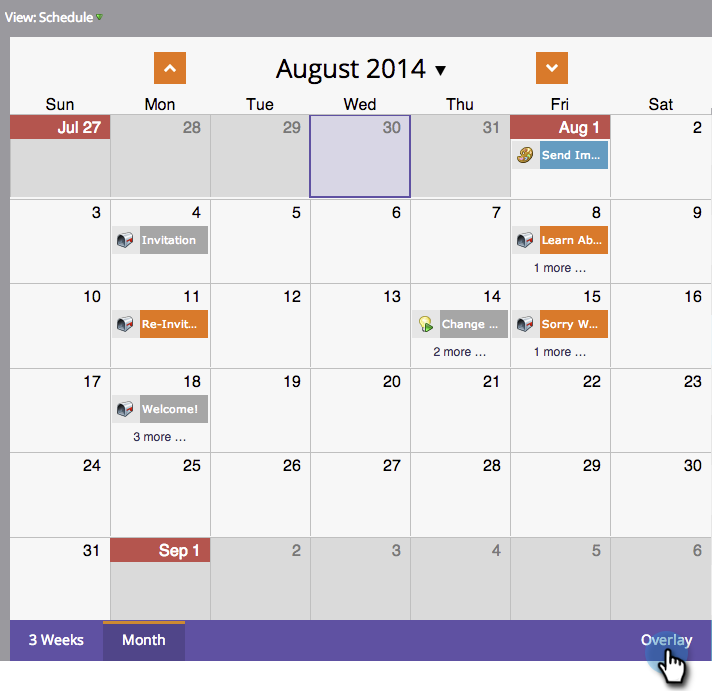
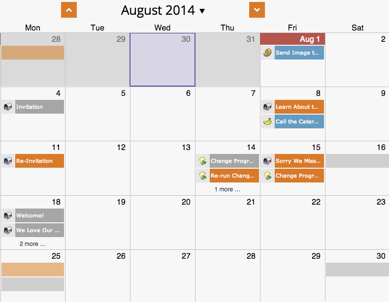

# Uso de uma sobreposição global {#using-a-global-overlay}

A sobreposição global na visualização de programação do programa permite que você veja o programa em relação a outros ativos agendados.

>[!PREREQUISITES]
>
>Você deve ter um [Licença do Calendário de marketing](/help/marketo/product-docs/core-marketo-concepts/marketing-calendar/understanding-the-calendar/issue-revoke-a-marketing-calendar-license.md){target="_blank"} para utilizar esse recurso.

## Usar a sobreposição global {#use-the-global-overlay}

1. Selecione seu programa.

   

1. Selecionar **[!UICONTROL Sobreposição]** no canto inferior direito.

   

1. Os blocos sólidos representam entradas nessa data. Clique para ver os detalhes.

   

   Os detalhes da entrada para itens de sobreposição serão somente leitura. Clique no programa pai para fazer alterações.

   

## Usar um filtro salvo como sobreposição {#use-a-saved-filter-as-an-overlay}

Se você tiver [salvou um filtro no Calendário de marketing](/help/marketo/product-docs/core-marketo-concepts/marketing-calendar/working-with-the-calendar/saving-a-filter-definition-in-the-marketing-calendar.md){target="_blank"}, você pode usá-lo como uma sobreposição na exibição de cronograma do programa.

1. Clique em **[!UICONTROL Sobreposição]** e selecione a definição do filtro.

   

   Agora você verá uma sobreposição definida pelo filtro salvo e selecionado.

   

   >[!MORELIKETHIS]
   >
   >[Criação de sobreposições personalizadas na visualização de programação](/help/marketo/product-docs/core-marketo-concepts/programs/program-schedule-view/creating-custom-overlays-in-program-schedule-view.md){target="_blank"}
