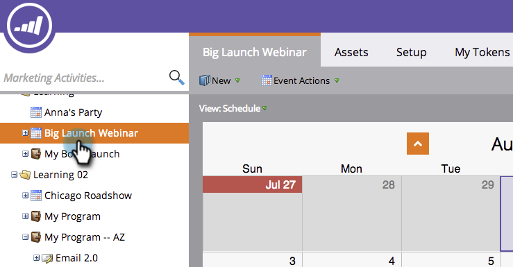

# Uso de uma sobreposição global {#using-a-global-overlay}

A sobreposição global na visualização de programação do programa permite que você veja o programa em relação a outros ativos agendados.

>[!PREREQUISITES]
>
>Você deve ter uma [licença do Calendário de marketing](/help/marketo/product-docs/core-marketo-concepts/marketing-calendar/understanding-the-calendar/issue-revoke-a-marketing-calendar-license.md){target="_blank"} para utilizar esse recurso.

## Usar a sobreposição global {#use-the-global-overlay}

1. Selecione seu programa.

   

1. Selecione **[!UICONTROL Sobreposição]** no canto inferior direito.

   

1. Os blocos sólidos representam entradas nessa data. Clique para ver os detalhes.

   

   Os detalhes da entrada para itens de sobreposição serão somente leitura. Clique no programa pai para fazer alterações.

   

## Usar um filtro salvo como sobreposição {#use-a-saved-filter-as-an-overlay}

Se você [salvou um filtro no Calendário de marketing](/help/marketo/product-docs/core-marketo-concepts/marketing-calendar/working-with-the-calendar/saving-a-filter-definition-in-the-marketing-calendar.md){target="_blank"}, poderá usá-lo como uma sobreposição na exibição do cronograma do programa.

1. Clique na lista suspensa **[!UICONTROL Sobreposição]** e selecione sua definição de filtro.

   

   Agora você verá uma sobreposição definida pelo filtro salvo e selecionado.

   

   >[!MORELIKETHIS]
   >
   >[Criando Sobreposições Personalizadas na Exibição de Agendamento do Programa](/help/marketo/product-docs/core-marketo-concepts/programs/program-schedule-view/creating-custom-overlays-in-program-schedule-view.md){target="_blank"}
