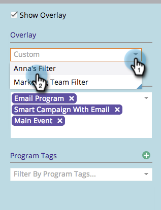

# Uso de uma sobreposição global {#using-a-global-overlay}

A sobreposição global na exibição de programação do programa permite visualizar o programa em relação a outros ativos programados.

>[!PREREQUISITES]
>
>Você deve ter uma [Licença de calendário de marketing](/help/marketo/product-docs/core-marketo-concepts/marketing-calendar/understanding-the-calendar/issue-revoke-a-marketing-calendar-license.md) para utilizar esse recurso.

## Usar a sobreposição global {#use-the-global-overlay}

1. Selecione o programa.

   

1. Selecione **Overlay** no canto inferior direito.

   

1. Os blocos sólidos representam entradas nessa data. Clique em para ver detalhes.

   

   Os detalhes de entrada para itens de sobreposição serão somente leitura. Clique no programa principal para fazer alterações.

   

## Usar um filtro salvo como uma sobreposição {#use-a-saved-filter-as-an-overlay}

Se você tiver [salvo um filtro no Calendário de marketing](/help/marketo/product-docs/core-marketo-concepts/marketing-calendar/working-with-the-calendar/saving-a-filter-definition-in-the-marketing-calendar.md), poderá usá-lo como uma sobreposição na exibição do agendamento do programa.

1. Clique no menu suspenso **Overlay** e selecione sua definição de filtro.

   

   Que fácil! Agora você verá uma sobreposição definida pelo filtro salvo e selecionado.

   

   >[!MORELIKETHIS]
   >
   >[Criação de sobreposições personalizadas na exibição Programação de programa](/help/marketo/product-docs/core-marketo-concepts/programs/program-schedule-view/creating-custom-overlays-in-program-schedule-view.md)
