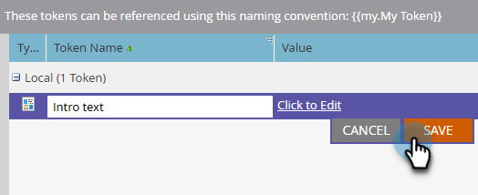

# Gerenciamento de meus tokens {#managing-my-tokens}

O uso de tokens pode simplificar seus esforços no Marketo Engage. Você pode usar [Meus tokens](/help/marketo/product-docs/core-marketo-concepts/programs/tokens/understanding-my-tokens-in-a-program.md){target="_blank"} (tokens personalizados) em etapas de fluxo, webhooks, emails e Landing Pages. Aqui está como fazê-los.

>[!TIP]
>
>Saiba mais sobre quais tokens já estão disponíveis em [Visão geral dos tokens](/help/marketo/product-docs/demand-generation/landing-pages/personalizing-landing-pages/tokens-overview.md){target="_blank"}.

## Criar um Meu token local ou global {#create-a-my-token}

>[!BEGINTABS]

>[!TAB Meus tokens locais]

1. Em **[!UICONTROL Atividades de marketing]**, selecione o programa ou a pasta de campanha desejada e clique na guia **[!UICONTROL Meus tokens]**.

   

1. Arraste o Meu token desejado para a tela.

   

1. Digite um nome exclusivo e insira um valor relevante.

   

1. Clique em **[!UICONTROL Salvar]**.

   

>[!TAB Meus Tokens Globais]

>[!NOTE]
>
>Permissões de administrador necessárias.

1. Vá para a área **[!UICONTROL Administrador]** e selecione **[!UICONTROL Meus tokens]**.

   

1. Arraste o Meu token desejado para a tela.

   

1. Digite um nome exclusivo e insira um valor relevante.

   

1. Clique em **[!UICONTROL Salvar]**.

   

>[!ENDTABS]

## Editar meu token {#edit-a-my-token}

1. Selecione o token que deseja editar e clique em **[!UICONTROL Editar token]**.

   

1. Faça as edições desejadas. Clique em **[!UICONTROL Salvar]** quando terminar.

   

## Excluir um Meu token {#delete-a-my-token}

>[!CAUTION]
>
>Ao excluir um Meu token, certifique-se de que ele não esteja referenciado atualmente em nenhum ativo. Um espaço em branco será exibido em qualquer lugar onde seja referenciado, se excluído.

1. Selecione o token que deseja excluir e clique em **[!UICONTROL Excluir token]**.

   

1. Clique em **[!UICONTROL Excluir]**.

   

   >[!MORELIKETHIS]
   >
   >* [Visão geral dos tokens](/help/marketo/product-docs/demand-generation/landing-pages/personalizing-landing-pages/tokens-overview.md){target="_blank"}
   >* [Compreendendo Meus Tokens em um Programa](/help/marketo/product-docs/core-marketo-concepts/programs/tokens/understanding-my-tokens-in-a-program.md){target="_blank"}
   >* [Usando URLs em Meus Tokens](/help/marketo/product-docs/email-marketing/general/using-tokens/using-urls-in-my-tokens.md){target="_blank"}
