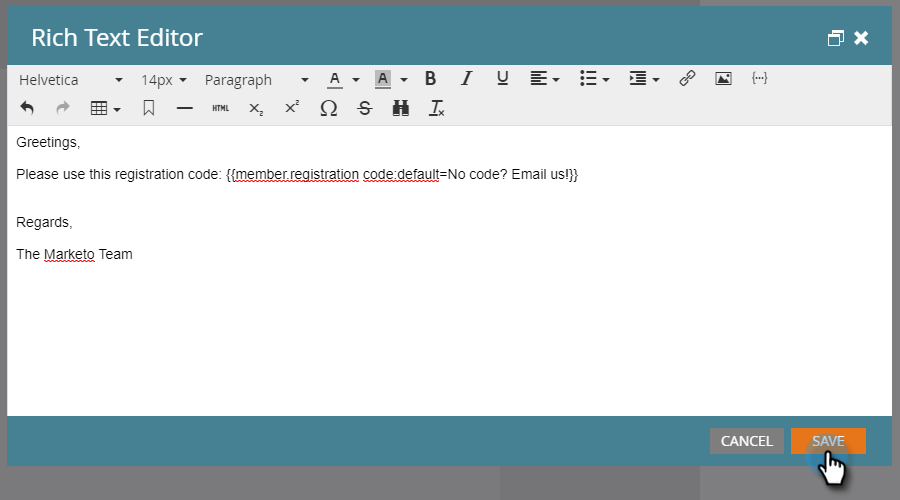

# Tokens de campo personalizado de membro do programa {#program-member-custom-field-tokens}

## Suporte a token para campos personalizados de membros do programa {#token-support-for-program-member-custom-fields}

Com o apoio dos recursos de Campos personalizados de membros do programa, o suporte para Campos personalizados de membros do programa está sendo estendido em estruturas de token.

Os tokens PMCF terão suporte no domínio membro da família de tokens.

Os tokens de membro são usados para campos no escopo de Membro do programa. A partir do estado atual, os Tokens de membro também são usados para inserir valores exclusivos de parceiros de serviços integrados. O token `{{member.webinar url}}` resolve automaticamente a URL de confirmação exclusiva da pessoa gerada pelo provedor de serviços. {{member.registration code}} resolve para o código de registro fornecido pelo provedor de serviços.

>[!NOTE]
>
>* Os campos personalizados do membro do programa podem ser usados somente no contexto de um programa.
>* Os tokens de campos personalizados do membro do programa não podem ser usados no: pré-cabeçalho de email, tokens de data em etapas de espera ou trechos.
>* O Status de Membro do Programa não é suportado em Tokens de Membro.

## Utilização de tokens de campo personalizado de membro do programa no Assets {#using-program-member-custom-field-tokens-in-assets}

Você pode inserir tokens de campos personalizados do membro do programa em emails, landing pages, SMS, notificações por push e webhooks.

**Emails**

1. Selecione o email desejado e clique em **[!UICONTROL Editar Rascunho]**.

   

1. Clique no ícone Inserir token.

   

1. Localize e selecione o Token de Campo Personalizado de Membro de Programa desejado, insira um valor padrão e clique em **[!UICONTROL Inserir]**.

   

1. Clique em **[!UICONTROL Salvar]**.

   

>[!NOTE]
>
>Não se esqueça de aprovar seu e-mail.

**Páginas de aterrissagem**

1. Selecione sua Landing Page e clique em **[!UICONTROL Editar rascunho]**.

   

   >[!NOTE]
   >
   >O designer da landing page é aberto em uma nova janela.

1. Clique duas vezes na caixa de rich text à qual deseja adicionar o token.

   

1. Clique no local em que deseja inserir o token e, em seguida, clique no ícone Inserir token.

   

1. Localize e selecione o token desejado.

   

1. Insira um Valor padrão e clique em **[!UICONTROL Inserir]**.

   

1. Clique em **[!UICONTROL Salvar]**.

   

**SMS**

1. Selecione o SMS desejado e clique em **[!UICONTROL Editar rascunho]**.

   

1. Clique no botão **`{{ Token`**.

   

1. Localize e selecione o Token do campo personalizado de membro do programa desejado. Insira um [!UICONTROL valor padrão] e clique em **[!UICONTROL Inserir]**.

   

1. Clique no menu suspenso Ações de SMS e selecione **[!UICONTROL Aprovar e fechar]**.

   

**Notificações por push**

1. Selecione a notificação por push desejada e clique em **[!UICONTROL Editar rascunho]**.

   

1. Clique em **[!UICONTROL Notificação por push]**.

   

1. Clique na mensagem no editor e no botão `{{` para obter o seletor de token.

   

1. Localize e selecione o Token do campo personalizado de membro do programa desejado. Insira um valor padrão e clique em **[!UICONTROL Inserir]**.

   

1. Clique em **[!UICONTROL Concluir]** para salvar e sair (ou em **[!UICONTROL Avançar]** para examinar primeiro).

   

>[!NOTE]
>
>Se o Campo personalizado Membro do programa para um Membro do programa não tiver valor, o token será substituído pelo valor padrão se ele tiver sido fornecido.

## Utilização de tokens de campo personalizado de membro do programa em campanhas {#using-program-member-custom-field-tokens-in-campaigns}

Os tokens de campo personalizado do membro do programa podem ser usados em:

* Criar tarefa
* Crie tarefa na Microsoft
* Momentos interessantes
* Ações de Alteração do Fluxo de Valor de Dados
* Webhooks
