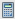

# Como entender meus tokens em um Programa {#understanding-my-tokens-in-a-program}

Um token é uma variável que você pode usar em emails, landings page e campanhas inteligentes para facilitar sua vida.

Além de Meus tokens, você também pode usar qualquer um dos tokens incorporados em seus programas. Confira a [Visão Geral de Tokens](/help/marketo/product-docs/demand-generation/landing-pages/personalizing-landing-pages/tokens-overview.md).

## Meus tokens {#my-tokens}

Meus tokens são variáveis personalizadas que qualquer pessoa pode criar. Eles são [criados](/help/marketo/product-docs/core-marketo-concepts/programs/tokens/managing-my-tokens.md) em pastas ou programas de campanha.

Meus tokens são exibidos desta forma: `{{my.Name Of Token}}`

Exemplos:

* `{{my.Event Date}}`
* `{{my.Webinar Speaker}}`

<table> 
 <thead> 
  <tr> 
   <th>Tipo de token</th> 
   <th>Descrição</th> 
  </tr> 
 </thead> 
 <tbody> 
  <tr> 
   <td>Arquivo de calendário </td> 
   <td>Use esse token para <a href="/help/marketo/product-docs/email-marketing/general/functions-in-the-editor/create-a-calendar-event-ics-file.md">adicionar um arquivo de evento de calendário (.i</a><a href="/help/marketo/product-docs/email-marketing/general/functions-in-the-editor/create-a-calendar-event-ics-file.md">cs)</a> aos seus emails e landings page.</td> 
  </tr> 
  <tr> 
   <td>
Data 
</td> 
   <td>Este token mantém um valor de data. A data é exibida como ano-mês-dia (por exemplo, 2016-05-23).</td> 
  </tr> 
  <tr> 
   <td>Script de email </td> 
   <td>Use esse token para executar um script Velocity em seus e-mails. Saiba mais <a href="http://developers.marketo.com/documentation/email-scripting/" title="Seguir link" rel="nofollow">aqui</a>. </td> 
  </tr> 
  <tr> 
   <td>Number </td> 
   <td>Qualquer número inteiro. Pode até ser negativo.</td> 
  </tr> 
  <tr> 
   <td>Rich Text </td> 
   <td>Isto é HTML. Use-o em emails e landings page.</td> 
  </tr> 
  <tr> 
   <td>Pontuação </td> 
   <td>Use esse token na <a href="/help/marketo/product-docs/core-marketo-concepts/smart-campaigns/flow-actions/use-tokens-in-flow-steps.md">etapa de fluxo de pontuação de alteração</a>. </td> 
  </tr> 
  <tr> 
   <td colspan="1">Campanha SFDC </td> 
   <td colspan="1">Use esse token para permitir que os clientes em potencial que se tornam parte de um Programa Marketo também sejam adicionados a qualquer Campanha SFDC adicionada.</td> 
  </tr> 
  <tr> 
   <td>Texto </td> 
   <td>Só um texto. Use-o quando o HTML for exagerado. O limite de tamanho para tokens de texto é de 524.288 caracteres (UTF-8) ou 2 MB.</td> 
  </tr> 
 </tbody> 
</table>

>[!CAUTION]
>
>Meus tokens não serão resolvidos ao enviar um email do Sales Insight no Microsoft Dynamics ou no Salesforce; somente os tokens padrão serão preenchidos (cliente potencial, Empresa etc.). Entretanto, os valores padrão para tokens _funcionarão_.

## Aninhamento de tokens {#nesting-tokens}

Quando você cria um novo token, ele pode ser referenciado por outros objetos na árvore. Há uma estrutura de nomenclatura para a qual o token foi criado para facilitar o gerenciamento.

* **Token local:** o token foi criado exatamente nesse programa ou pasta.
* **Token herdado:** o token foi criado na árvore em algum lugar em um programa ou pasta de nível superior.
* **Token substituído:** o token foi herdado e alguém fez uma exceção neste programa ou pasta.

É possível fazer variáveis globais e substituí-las em níveis mais baixos na árvore.

Mover programas e pastas também afeta os tokens. Sempre verifique se as referências não estão quebradas durante a mudança.

>[!NOTE]
>
>Se o e-mail enviado de um programa de envolvimento for um e-mail filho de um programa padrão (não local para o programa de envolvimento), todos os Meus tokens usados no e-mail serão resolvidos do programa padrão no qual o e-mail filho reside.

>[!MORELIKETHIS]
>
>* [Visão geral dos tokens](/help/marketo/product-docs/demand-generation/landing-pages/personalizing-landing-pages/tokens-overview.md)
>* [Gerenciando Meus Tokens](/help/marketo/product-docs/core-marketo-concepts/programs/tokens/managing-my-tokens.md)

