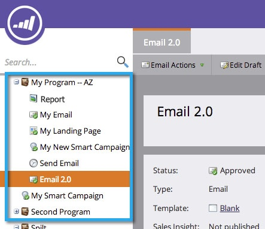

# Clonar um ativo em um Programa {#clone-an-asset-in-a-program}

Clonar um programa clona _tudo_. Às vezes, você só quer clonar um ativo. Veja como.

>[!NOTE]
>
>Você precisará executar etapas adicionais para [clonar um grupo de teste de landing page](/help/marketo/product-docs/demand-generation/landing-pages/landing-page-actions/cloning-a-landing-page-test-group.md).

## Clonar um ativo local {#clone-a-local-asset}

1. Vá para **Marketing** **Atividade**.

   

1. Selecione seu programa.

   

1. Clique com o botão direito do mouse no ativo local que deseja clonar. Clique em **Clonar**.

   

1. Cada tipo de ativo apresenta uma caixa de diálogo diferente. Basta preencher as informações e clicar em **Clonar**.

   

   >[!TIP]
   >
   >Você também pode clonar um ativo para um programa diferente. Use o menu suspenso **Programa** para fazer sua seleção.

1. Ótimo! Agora você deve ver o novo ativo clonado.

   

   >[!NOTE]
   >
   >[Clonar um Programa](/help/marketo/product-docs/core-marketo-concepts/programs/working-with-programs/clone-a-program.md)
