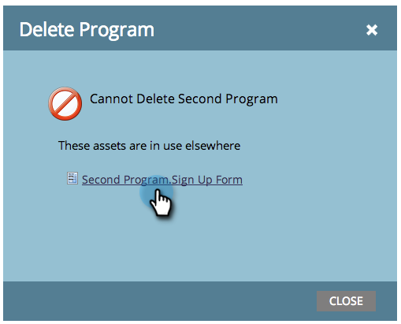

# Excluir um programa {#delete-a-program}

Você pode arquivar um programa, mas às vezes só quer se livrar dele permanentemente. Veja como.

1. Selecione o programa que deseja excluir.

1. Clique no menu suspenso **[!UICONTROL Ações do Programa]** e selecione **[!UICONTROL Excluir]**.

   

1. Selecione o botão de opção &quot;Excluir tudo...&quot;. Revise os efeitos da exclusão do programa e clique em **[!UICONTROL Excluir]** para confirmar.

>[!TIP]
>
>Programas de arquivamento mantêm os dados do programa, mas o coloca fora do seu caminho. Selecione essa opção e clique em **[!UICONTROL Avançar]** para ver mais detalhes sobre arquivamento.

Concluído. É como se o programa nunca tivesse existido.

## Por que não posso excluir meu programa? {#why-cant-i-delete-my-program}

Os programas podem conter ativos usados em outro lugar do sistema; isso impedirá a exclusão de um programa.

Para corrigir o problema, talvez seja necessário detalhar e cancelar a aprovação/exclusão. Siga estas etapas.

1. Clique no link para ir para o ativo.

   

1. Clique em **[!UICONTROL Usado por]** para ver onde o ativo está em uso.

   

   Depois de saber onde seu ativo está sendo usado, acesse-o e cancele a aprovação/exclusão. Em seguida, tente excluir o programa novamente.
