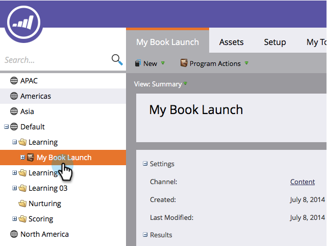

# Editar configurações de comportamento das análises {#edit-analytics-behavior-settings}

Você pode definir o [comportamento do analytics no nível do administrador nos canais](/help/marketo/product-docs/reporting/revenue-cycle-analytics/program-analytics/make-a-program-without-a-period-cost-available-in-revenue-explorer-and-analyzers.md){target="_blank"}, mas também pode editá-lo no nível do programa. Veja como.

1. Vá para **[!UICONTROL Atividades de marketing]**.

   

1. Localize e selecione seu programa.

   

1. Na guia **[!UICONTROL Configuração]**, arraste o [!UICONTROL Comportamento do Analytics] para a tela.

   

1. Selecione o comportamento desejado do Analytics.

   

>[!NOTE]
>
>**Definição**
>
>**[!UICONTROL Inclusivo]** - Essa opção garantirá que o programa esteja disponível para relatórios no Gerenciador de receita e nos analisadores, independentemente de você ter incluído ou não um custo de período.
>
>**[!UICONTROL Operacional]** - Esta opção faz com que o programa não apareça no Gerenciador de Receitas nem nos Analisadores.

>[!NOTE]
>
>O comportamento padrão (se essa configuração não for aplicada) é o programa ser incluído no Analytics SOMENTE se houver pelo menos um custo de período, mesmo um com zero dólares atribuídos.

1. Clique em **[!UICONTROL Salvar]**.

   

Muito bem! Agora você sabe como substituir o comportamento do Analytics no nível do programa.

>[!NOTE]
>
>As alterações entrarão em vigor no dia seguinte e o programa será disponibilizado ou retirado do explorador de receita e dos analisadores.
