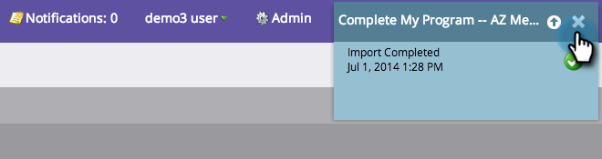

# Importar membros de uma planilha para um Programa {#import-members-from-a-spreadsheet-into-a-program}

Você pode importar uma lista de pessoas que automaticamente se tornam membros de um programa. Aqui está o que fazer.

## Preparar seu arquivo CSV {#prepare-your-csv-file}

1. Crie um arquivo CSV padrão no Excel, como o exemplo abaixo.

   

   >[!CAUTION]
   >
   >Ao importar uma data para um campo de data, use este formato: 23/9/13 (Mês/Dia/Ano).

## Importar seu CSV para o Marketing {#import-your-csv-into-marketo}

1. No seu programa, vá para a seção **Deputados** .

   

1. Clique em **Importar membros**.

   

1. Selecione o CSV e clique em **Avançar**.

   

1. Mapeie os valores de dados da lista para os campos de marketing correspondentes e clique em **Avançar**.

   

   >[!NOTE]
   >
   >Se houver campos que você não deseja importar, selecione **IGNORAR** no menu suspenso Campo de marketing.

1. Selecione o Status **do** Membro para sua lista.

   

1. Clique em **Importar**.

   

1. Aguarde até que o Marketo conclua a importação e feche a caixa de diálogo de confirmação.

   

   Ótimo! Você deve ver os novos membros que importou.

   

>[!NOTE]
>
>**Artigos relacionados**
>
>* [Gerenciar e Visualização membros](manage-and-view-members.md)

>

